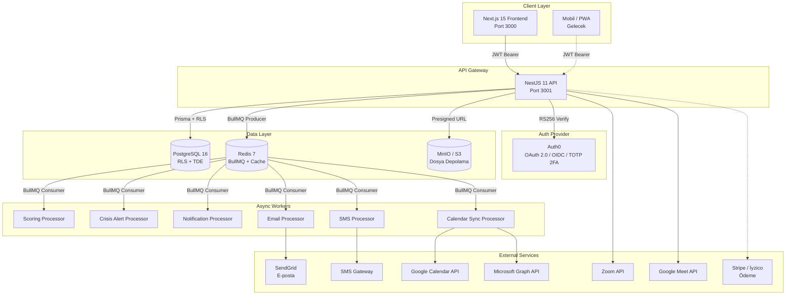
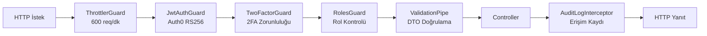
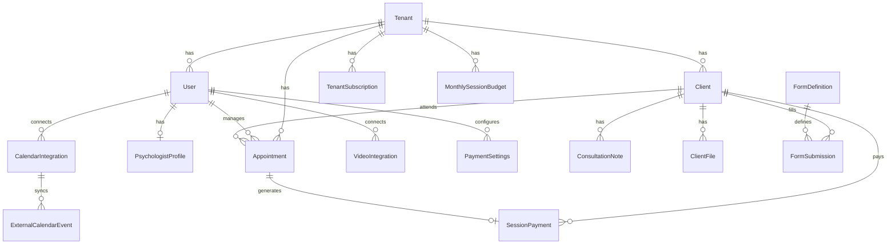
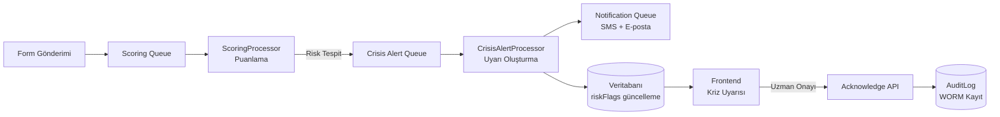
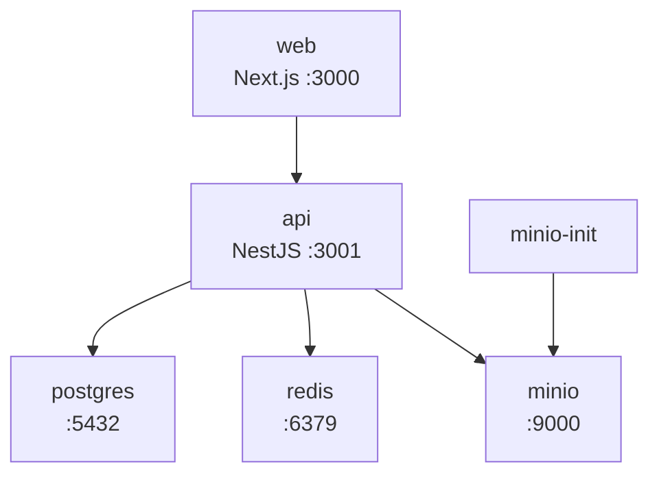
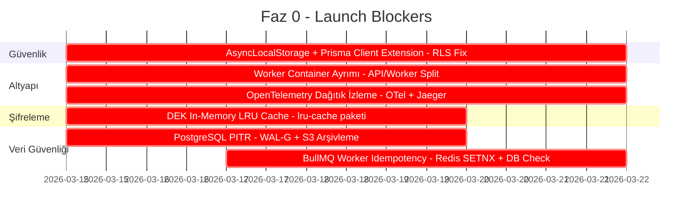
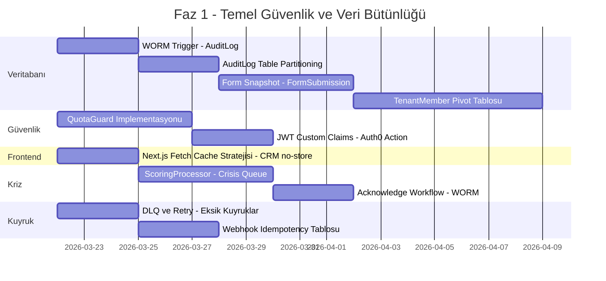
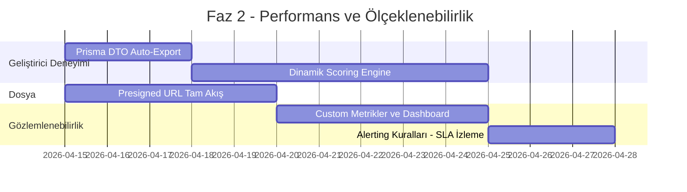
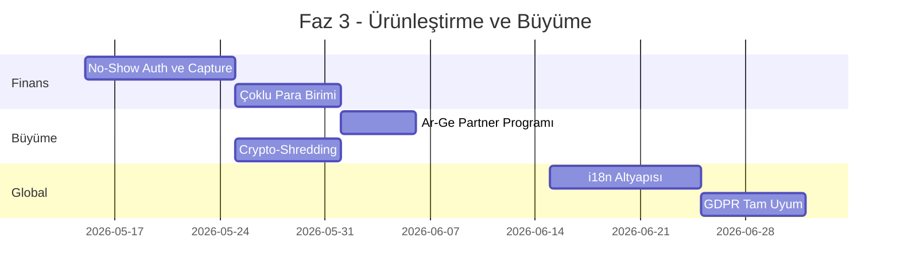

<div align="center">

# 🧠 Psikoport

**Psikolog ve PDR Uzmanları İçin Kurumsal SaaS Danışmanlık Yönetim Platformu**

[](https://nodejs.org/)
[](https://nestjs.com/)
[](https://nextjs.org/)
[](https://www.postgresql.org/)
[](https://www.prisma.io/)
[](https://redis.io/)
[](https://auth0.com/)
[](https://www.docker.com/)
[](#lisans)

---

*Danışan CRM, psikometrik test motoru, takvim & randevu yönetimi, çok katmanlı şifreleme (AES-256-GCM + Envelope Encryption), gelir takibi ve KVKK/GDPR uyumlu altyapıyı tek bir entegre sistemde birleştiren, çok kiracılı (multi-tenant) mimari üzerine inşa edilmiş profesyonel platform.*

</div>

---

## 📑 İçindekiler

- [Proje Genel Bakış](#proje-genel-bakış)
- [Sistem Mimarisi](#sistem-mimarisi)
- [Teknoloji Yığını](#teknoloji-yığını)
- [Proje Yapısı (Monorepo)](#proje-yapısı-monorepo)
- [Veritabanı Mimarisi](#veritabanı-mimarisi)
- [Güvenlik, Kimlik Doğrulama ve Yasal Uyum](#güvenlik-kimlik-doğrulama-ve-yasal-uyum)
- [Çekirdek İş Mantığı](#çekirdek-iş-mantığı)
- [Asenkron Operasyonlar ve Altyapı](#asenkron-operasyonlar-ve-altyapı)
- [Büyüme, Finans ve Ürünleştirme](#büyüme-finans-ve-ürünleştirme)
- [REST API Referansı](#rest-api-referansı)
- [Frontend Mimarisi](#frontend-mimarisi)
- [NestJS Modül Haritası](#nestjs-modül-haritası)
- [Shared Paketler](#shared-paketler)
- [Altyapı ve Docker](#altyapı-ve-docker)
- [Hızlı Başlangıç](#hızlı-başlangıç)
- [Geliştirme Komutları](#geliştirme-komutları)
- [Canlıya Çıkmadan Önceki Kritik İşler](#canlıya-çıkmadan-önceki-kritik-işler)
- [Teknik Borç ve İyileştirme Alanları](#teknik-borç-ve-iyileştirme-alanları)
- [Yol Haritası](#yol-haritası)
- [Lisans](#lisans)

---

## Proje Genel Bakış

Psikoport, psikolog ve PDR uzmanlarının günlük iş akışlarını dijitalleştiren, danışan yönetiminden psikometrik test puanlamasına, randevu takibinden gelir analizine kadar tüm süreçleri kapsayan bir SaaS platformudur.

### Temel Yetenekler

| Yetenek | Açıklama | Durum |
|---------|----------|-------|
| **Çok Kiracılı Mimari** | Her uzman izole bir tenant; PostgreSQL RLS ile veri ayrıştırması | ✅ Aktif |
| **Şifreli Seans Notları** | AES-256-GCM + Envelope Encryption (KEK/DEK) | ✅ Aktif |
| **Psikometrik Test Motoru** | PHQ-9, GAD-7, DASS-21, WHO-5, PSS-10, PCL-5 otomatik puanlama | ✅ Aktif |
| **Randevu Yönetimi** | Takvim, müsaitlik, çakışma kontrolü, otomatik hatırlatma | ✅ Aktif |
| **Danışan CRM** | Kayıt, dosya, not, zaman çizelgesi, CSV/Excel import/export | ✅ Aktif |
| **Takvim Entegrasyonları** | Google Calendar & Outlook çift yönlü senkronizasyon | ✅ Aktif |
| **Video Konferans** | Zoom & Google Meet otomatik bağlantı oluşturma | ✅ Aktif |
| **Kriz Protokolü** | Yüksek riskli test sonuçlarında otomatik uyarı sistemi | ✅ Aktif |
| **Ödeme Takibi** | Seans bazlı ödeme, gelir raporu, hatırlatma | ✅ Aktif |
| **KVKK/GDPR Uyumu** | Rıza yönetimi, WORM denetim günlüğü, crypto-shredding | ✅ Aktif |
| **Abonelik & Kota Yönetimi** | Plan bazlı sınırlamalar, aylık seans bütçesi | ✅ Aktif |
| **Blog & Profil** | SEO optimize herkese açık uzman profili ve blog | ✅ Aktif |

---

## Sistem Mimarisi

### Üst Düzey Mimari Diyagramı



### Veri Akışı

1. **Kullanıcı → Frontend:** Auth0 ile giriş yapılır, JWT token alınır
2. **Frontend → API:** `Authorization: Bearer <token>` header ile istek gönderilir
3. **API Guard Zinciri:** JWT doğrulama → 2FA kontrolü → Rol kontrolü → Kota kontrolü
4. **API → PostgreSQL:** RLS ile `SET app.current_tenant` ayarlanır; sadece ilgili tenant verisi döner
5. **API → Redis (BullMQ):** E-posta, SMS, puanlama, takvim senkronizasyonu gibi asenkron işler kuyruğa alınır
6. **Workers → Harici Servisler:** Kuyruktan alınan işler ilgili servislere iletilir

### Guard Zinciri (İstek İşleme Sırası)



| Sıra | Guard / Pipe / Interceptor | Sorumluluk |
|------|---------------------------|------------|
| 1 | [`ThrottlerGuard`](apps/api/src/app.module.ts:74) | Rate limiting — 600 istek/dakika |
| 2 | [`JwtAuthGuard`](apps/api/src/modules/common/guards/auth.guard.ts) | JWT doğrulama (Auth0 RS256 + JWKS) |
| 3 | [`TwoFactorGuard`](apps/api/src/modules/common/guards/two-factor.guard.ts) | TOTP 2FA zorunluluğu kontrolü |
| 4 | [`RolesGuard`](apps/api/src/modules/common/guards/roles.guard.ts) | Rol tabanlı erişim kontrolü (PSYCHOLOGIST, ASSISTANT, SUPER_ADMIN) |
| 5 | [`ValidationPipe`](apps/api/src/modules/common/pipes/validation.pipe.ts) | class-validator ile DTO doğrulama |
| 6 | [`AuditLogInterceptor`](apps/api/src/modules/common/interceptors/audit-log.interceptor.ts) | Hassas erişim kaydı (WORM) |
| 7 | [`ResponseTimingInterceptor`](apps/api/src/modules/common/interceptors/response-timing.interceptor.ts) | Yanıt süresi ölçümü |
| 8 | [`HttpExceptionFilter`](apps/api/src/modules/common/filters/http-exception.filter.ts) | Hata yanıt standardizasyonu |

---

## Teknoloji Yığını

| Katman | Teknoloji | Versiyon | Notlar |
|--------|-----------|----------|--------|
| **Frontend** | Next.js (App Router) | 15.x | Turbopack, SSR/SSG |
| **UI** | React 19, Tailwind CSS 4, Shadcn/ui, Radix UI | — | Erişilebilir bileşen kütüphanesi |
| **State** | Zustand, TanStack Query | — | İstemci + sunucu state yönetimi |
| **Backend** | NestJS | 11.x | Modüler mimari, Guard zinciri |
| **ORM** | Prisma | 5.x | Type-safe veritabanı erişimi |
| **Kimlik Doğrulama** | Auth0 (OAuth 2.0, OIDC, TOTP 2FA) | — | RS256 JWT, MFA zorunlu |
| **Veritabanı** | PostgreSQL | 16.x | RLS, TDE, WORM trigger |
| **Önbellek & Kuyruk** | Redis 7, BullMQ | — | Asenkron iş yönetimi |
| **Şifreleme** | AES-256-GCM, Envelope Encryption | Hybrid | Uygulama + Veritabanı katmanı |
| **E-posta** | SendGrid | — | Transactional e-posta |
| **Depolama** | AWS S3 / MinIO | — | SSE-KMS, Presigned URL |
| **Gözlemlenebilirlik** | OpenTelemetry, Jaeger/SigNoz | — | Dağıtık izleme, APM (planlanan) |
| **Yedekleme** | WAL-G / pgBackRest | — | PostgreSQL PITR, S3 arşivleme (planlanan) |
| **Monorepo** | Turborepo, pnpm workspaces | — | Paralel build, paylaşımlı paketler |
| **Test** | Jest, Supertest | — | Birim + entegrasyon testleri |
| **Konteyner** | Docker Compose | — | PostgreSQL, Redis, MinIO, API, Web, Jaeger |

---

## Proje Yapısı (Monorepo)

```
psikoport/                          # Root — Turborepo + pnpm workspaces
├── apps/
│   ├── api/                        # NestJS 11 Backend (Port 3001)
│   │   ├── prisma/
│   │   │   ├── schema.prisma       # Veritabanı şeması (660 satır, 25+ model)
│   │   │   ├── migrations/         # 25+ migration dosyası
│   │   │   ├── seed.ts             # Veritabanı seed verileri
│   │   │   └── create-admin.ts     # Super Admin oluşturma scripti
│   │   └── src/
│   │       ├── app.module.ts       # Ana modül — tüm bağımlılıklar
│   │       ├── database/           # PrismaService
│   │       ├── modules/
│   │       │   ├── admin/          # Lisans yönetimi, sistem ayarları
│   │       │   ├── auth/           # Kayıt, giriş, davet, JWT stratejisi
│   │       │   ├── blog/           # Blog yazıları
│   │       │   ├── calendar/       # Randevu, müsaitlik, takvim senkronizasyonu, video
│   │       │   ├── clients/        # CRM: danışan, notlar, dosyalar, timeline, export
│   │       │   ├── common/         # Guards, filters, pipes, interceptors, decorators
│   │       │   ├── crisis/         # Kriz protokolü ve uyarı sistemi
│   │       │   ├── finance/        # Ödeme takibi ve ayarları
│   │       │   ├── legal/          # KVKK rızaları, denetim günlüğü
│   │       │   ├── profile/        # Psikolog profili (SEO)
│   │       │   ├── subscriptions/  # Abonelik ve plan yönetimi
│   │       │   └── tests/          # Form tanımları ve gönderimler
│   │       └── queue/              # BullMQ kuyruk işlemcileri (6 kuyruk)
│   └── frontend/                   # Next.js 15 Frontend (Port 3000)
├── shared/
│   └── packages/
│       ├── shared/                 # @psikoport/shared — ortak tipler ve sabitler
│       ├── form-schemas/           # @psikoport/form-schemas — test ve form şemaları
│       └── scoring-engine/         # @psikoport/scoring-engine — puanlama motoru
├── infra/
│   ├── docker-compose.yml          # PostgreSQL, Redis, MinIO, API, Web
│   ├── Dockerfile.api              # NestJS production build
│   └── Dockerfile.frontend         # Next.js production build
├── package.json                    # Root scripts (Turborepo)
├── pnpm-workspace.yaml             # Workspace tanımları
└── README.md                       # Bu dosya
```

### AppModule Bağımlılık Ağacı

```
AppModule
├── ConfigModule (global)
├── PrismaModule
├── BullModule (Redis bağlantısı)
├── ThrottlerModule (600 req/dk)
├── AuthModule
│   └── SubscriptionModule (geçişli bağımlılık)
├── StorageModule (S3/MinIO)
├── NotificationModule (SendGrid, SMS — sms + email kuyrukları)
├── ClientsModule
│   ├── NotesModule (şifreli seans notları)
│   ├── TimelineModule (danışan aktiviteleri)
│   ├── FilesModule (S3 dosya yönetimi)
│   └── ExportModule (CSV/Excel dışa aktarma)
├── LegalModule (Consent, AuditLog)
├── TestsModule (FormDefinitions, FormSubmissions)
├── CalendarModule
│   ├── Scheduling (Appointments, Availability)
│   ├── CalendarIntegrations (Google/Outlook OAuth)
│   ├── CalendarSync (çift yönlü senkronizasyon)
│   ├── Video (Zoom, Google Meet)
│   └── SubscriptionModule (geçişli bağımlılık)
├── FinanceModule (SessionPayment, PaymentSettings)
├── ProfileModule (PsychologistProfile)
├── CrisisModule (kriz uyarıları)
├── AdminModule (lisans, sistem ayarları)
│   └── SubscriptionModule (geçişli bağımlılık)
├── BlogModule (blog yazıları)
└── QueueModule (6 BullMQ kuyruk işlemcisi)

Not: SubscriptionModule doğrudan AppModule tarafından import edilmez;
AuthModule, AdminModule ve CalendarModule üzerinden geçişli olarak yüklenir.
Toplam 8 kuyruk: QueueModule (6) + NotificationModule (2: sms, email).
```

---

## Veritabanı Mimarisi

Veritabanı şeması [`apps/api/prisma/schema.prisma`](apps/api/prisma/schema.prisma) dosyasında tanımlanmıştır. 25+ migration ile evrimleşen yapı, 660+ satır Prisma şeması içerir.

### Entity-Relationship Diyagramı



### Model Kataloğu

#### 🔐 Auth ve Tenancy

| Model | Açıklama | Kritik Alanlar |
|-------|----------|----------------|
| [`Tenant`](apps/api/prisma/schema.prisma:52) | Çok kiracılı kuruluş | `plan`, `maxClients`, `videoProvider`, `defaultCurrency` |
| [`User`](apps/api/prisma/schema.prisma:87) | Auth0 bağlantılı kullanıcı | `auth0Sub`, `role`, `is2faEnabled`, `licenseStatus` |
| [`Invitation`](apps/api/prisma/schema.prisma:113) | Asistan davet token'ları | `token`, `expiresAt`, `acceptedAt` |

#### 📋 Abonelik ve Kota

| Model | Açıklama | Kritik Alanlar |
|-------|----------|----------------|
| [`PlanConfig`](apps/api/prisma/schema.prisma:583) | Admin tarafından ayarlanan plan parametreleri | `monthlySessionQuota`, `customFormQuota`, `monthlyPrice` |
| [`TenantSubscription`](apps/api/prisma/schema.prisma:601) | Satın alma anındaki plan snapshot'ı (değişmez) | `planCode`, `monthlySessionQuota`, `startDate`, `endDate` |
| [`MonthlySessionBudget`](apps/api/prisma/schema.prisma:620) | Aylık seans bütçesi (devretmez) | `year`, `month`, `totalQuota`, `usedCount` |

#### 👤 Danışan Yönetimi (CRM)

| Model | Açıklama | Kritik Alanlar |
|-------|----------|----------------|
| [`Client`](apps/api/prisma/schema.prisma:222) | Danışan kaydı | `status`, `deletedAt`, `anonymizedAt`, `tags`, `complaintAreas` |
| [`ConsultationNote`](apps/api/prisma/schema.prisma:262) | Şifreli seans notları (AES-256-GCM) | `encryptedContent`, `encryptedDek`, `contentNonce`, `contentAuthTag` |
| [`ClientFile`](apps/api/prisma/schema.prisma:296) | S3 dosya metadata | `fileKey`, `mimeType`, `uploadedBy` |

#### 📝 Test ve Form

| Model | Açıklama | Kritik Alanlar |
|-------|----------|----------------|
| [`FormDefinition`](apps/api/prisma/schema.prisma:322) | Form şeması ve puanlama konfigürasyonu | `schema` (JSON), `scoringConfig` (JSON), `formType`, `version` |
| [`FormSubmission`](apps/api/prisma/schema.prisma:356) | Form yanıtları, skorlar ve risk bayrakları | `responses`, `scores`, `riskFlags`, `crisisAcknowledgedAt` |

#### 📅 Takvim ve Randevu

| Model | Açıklama | Kritik Alanlar |
|-------|----------|----------------|
| [`Appointment`](apps/api/prisma/schema.prisma:386) | Randevu kaydı | `status`, `locationType`, `videoProvider`, `videoMeetingUrl` |
| [`AvailabilitySlot`](apps/api/prisma/schema.prisma:428) | Haftalık müsaitlik tanımları | `dayOfWeek`, `startTime`, `endTime` |
| [`CalendarIntegration`](apps/api/prisma/schema.prisma:451) | Google/Outlook OAuth token'ları (şifreli) | `encryptedAccessToken`, `syncToken`, `channelId` |
| [`ExternalCalendarEvent`](apps/api/prisma/schema.prisma:477) | Senkronize edilen harici etkinlikler | `googleEventId`, `startTime`, `endTime`, `deleted` |
| [`VideoIntegration`](apps/api/prisma/schema.prisma:499) | Zoom/Meet OAuth token'ları (şifreli) | `encryptedAccessToken`, `provider` |

#### 💰 Finans

| Model | Açıklama | Kritik Alanlar |
|-------|----------|----------------|
| [`SessionPayment`](apps/api/prisma/schema.prisma:533) | Randevu bazlı ödeme kayıtları | `amount`, `currency`, `status`, `paymentMethod` |
| [`PaymentSettings`](apps/api/prisma/schema.prisma:562) | Uzman bazlı ücret ayarları | `defaultSessionFee`, `currency`, `reminderDays` |

#### ⚖️ Yasal ve Denetim

| Model | Açıklama | Kritik Alanlar |
|-------|----------|----------------|
| [`ConsentText`](apps/api/prisma/schema.prisma:180) | KVKK metin versiyonları | `consentType`, `version`, `bodyHash` (SHA-256) |
| [`Consent`](apps/api/prisma/schema.prisma:196) | Danışanlardan alınan rızalar | `isGranted`, `grantedAt`, `revokedAt`, `ipAddress` |
| [`AuditLog`](apps/api/prisma/schema.prisma:637) | WORM denetim günlüğü | `action`, `resourceType`, `resourceId`, `details` (JSON) |

#### 🌐 Profil ve Blog

| Model | Açıklama | Kritik Alanlar |
|-------|----------|----------------|
| [`PsychologistProfile`](apps/api/prisma/schema.prisma:131) | Herkese açık uzman profili | `bio`, `specializations`, `seoTitle`, `seoDescription` |
| [`BlogPost`](apps/api/prisma/schema.prisma:156) | Tenant blog yazıları | `title`, `content`, `publishedAt` |

### Enum Değerleri

| Enum | Değerler | Kullanım |
|------|----------|----------|
| `TenantPlan` | `FREE`, `PRO`, `PROPLUS` | Abonelik planları |
| `UserRole` | `SUPER_ADMIN`, `PSYCHOLOGIST`, `ASSISTANT` | Kullanıcı rolleri |
| `AppointmentStatus` | `SCHEDULED`, `COMPLETED`, `CANCELLED`, `NO_SHOW` | Randevu durumları |
| `LocationType` | `IN_PERSON`, `ONLINE` | Seans türü |
| `VideoProvider` | `NONE`, `ZOOM`, `GOOGLE_MEET` | Video sağlayıcı |
| `LicenseStatus` | `PENDING`, `VERIFIED`, `REJECTED` | Lisans doğrulama |
| `FormType` | `INTAKE`, `INTAKE_ADDON`, `PSYCHOMETRIC`, `CUSTOM` | Form türleri |
| `CompletionStatus` | `DRAFT`, `COMPLETE`, `EXPIRED` | Form tamamlanma durumu |
| `PaymentStatus` | `PENDING`, `PAID`, `PARTIAL`, `CANCELLED` | Ödeme durumu |
| `ConsentType` | `KVKK_DATA_PROCESSING`, `KVKK_SPECIAL_DATA`, `SESSION_RECORDING`, ... | Rıza türleri |

### Row-Level Security (RLS)

Tüm tenant-scoped tablolar `tenant_id` sütunu içerir. Her API isteğinde [`JwtStrategy.validate()`](apps/api/src/modules/auth/strategies/jwt.strategy.ts:100) içinde `SELECT set_current_tenant(tenantId)` çalıştırılarak veri izolasyonu sağlanır.

> [!CAUTION]
> **🚨 CANLIYA ÇIKMADAN ÖNCEKİ EN KRİTİK İŞ: PostgreSQL RLS ve Prisma Bağlantı Havuzu Uyumsuzluğu — Veri Sızıntısı Riski**
>
> Prisma, performans için bir bağlantı havuzu (connection pool) kullanır. Bir API isteğinde `SET app.current_tenant` çağrıldığında, o veritabanı bağlantısı havuza geri döner ve başka bir kullanıcının isteği bu bağlantıyı devralırsa **tenant verileri karışabilir**. Bu, bir uzmanın başka bir uzmanın danışan notlarını görmesi anlamına gelir — ruh sağlığı platformu için felaket senaryosu.
>
> **Zorunlu Çözüm: AsyncLocalStorage (ALS) + Prisma Client Extensions + `SET LOCAL`**
>
> | Adım | Detay |
> |------|-------|
> | **1. AsyncLocalStorage** | Node.js'in `AsyncLocalStorage` API'sini kullanarak her HTTP isteğine özgü bir context oluşturun. Tenant ID'yi JWT'den alıp bu context'e yazın. |
> | **2. Prisma Client Extensions** | Prisma Client Extensions ile her sorgu öncesinde ALS'den tenant ID'yi okuyup `$transaction` bloğu içinde `SET LOCAL app.current_tenant` çalıştırın. `SET LOCAL` sadece o transaction içinde geçerlidir — bağlantı havuzuna geri döndüğünde sıfırlanır. |
> | **3. Transaction İzolasyonu** | Tüm tenant-scoped sorguların `$transaction` bloğu içinde çalışmasını garanti altına alın. İzolasyonun transaction dışına sızmamasını sağlayın. |
>
> **İstek Bazlı Tenant İzolasyon Akışı:**
> ```mermaid
> sequenceDiagram
>     participant Client as HTTP İstek
>     participant MW as NestJS Middleware
>     participant ALS as AsyncLocalStorage
>     participant PCE as Prisma Client Extension
>     participant PG as PostgreSQL
>
>     Client->>MW: JWT Bearer Token
>     MW->>MW: JWT doğrula, tenantId çıkar
>     MW->>ALS: tenantId yaz - request context
>     MW->>PCE: Prisma sorgusu
>     PCE->>ALS: tenantId oku
>     PCE->>PG: BEGIN TRANSACTION
>     PCE->>PG: SET LOCAL app.current_tenant = tenantId
>     PCE->>PG: SELECT ... FROM clients - RLS filtreler
>     PCE->>PG: COMMIT
>     Note over PG: SET LOCAL otomatik sıfırlanır
>     PG-->>Client: Sadece ilgili tenant verisi
> ```
>
> **Bu iş Faz 1'de değil, canlıya çıkmadan önce tamamlanması gereken en kritik iştir.**

### 💾 Yedekleme ve Felaket Kurtarma (Disaster Recovery)

> [!CAUTION]
> **🚨 CANLIYA ÇIKMADAN ÖNCEKİ KRİTİK İŞ: PostgreSQL PITR (Point-in-Time Recovery) — Veri Kaybı Riski**
>
> Mevcut altyapıda hiçbir yedekleme stratejisi bulunmamaktadır. [`docker-compose.yml`](infra/docker-compose.yml) içindeki PostgreSQL servisi basit bir Docker volume kullanmakta olup, WAL arşivleme, otomatik yedekleme veya kurtarma prosedürü tanımlanmamıştır. Yanlışlıkla bir tenant'ın verisi bozulduğunda veya silindiğinde sistemi **ne kadar geriye döndürebileceğiniz belirsizdir**.
>
> Sağlık verisi tutan bir SaaS platformunda günde bir kez alınan dump yedekleri **yeterli değildir** — 24 saatlik veri kaybı (RPO) kabul edilemez. KVKK ve GDPR düzenlemeleri, kişisel verilerin korunması için uygun teknik tedbirlerin alınmasını zorunlu kılar; bu tedbirler yedekleme ve kurtarma prosedürlerini de kapsar.
>
> | Özellik | Detay |
> |---------|-------|
> | **Açıklama** | PostgreSQL için sürekli WAL (Write-Ahead Log) arşivleme ile saniye düzeyinde geri dönüş yeteneği. Herhangi bir anda "şu tarihe geri dön" komutuyla veritabanını istenen noktaya kurtarma |
> | **Teknik Gereksinimler** | WAL-G veya pgBackRest kurulumu, S3/MinIO'ya WAL arşivleme, base backup zamanlaması, kurtarma prosedürü dokümantasyonu, düzenli kurtarma testi |
> | **Bağımlılıklar** | S3/MinIO (mevcut), PostgreSQL WAL konfigürasyonu |
> | **Öncelik** | 🔴 Yüksek (Canlıya Çıkmadan Önce) |
> | **Tahmini Etki** | Veri kaybı riskinin saniye düzeyine indirilmesi, yasal uyumluluk, operasyonel güvence |
>
> **RTO ve RPO Hedefleri:**
>
> | Metrik | Hedef | Açıklama |
> |--------|-------|----------|
> | **RPO (Recovery Point Objective)** | ≤ 5 dakika | Maksimum kabul edilebilir veri kaybı süresi. Sürekli WAL arşivleme ile saniye düzeyine indirilebilir |
> | **RTO (Recovery Time Objective)** | ≤ 30 dakika | Felaket anından sistemi tekrar çalışır hale getirme süresi. Base backup boyutuna bağlı |
> | **Yedek Doğrulama** | Haftalık | Yedeklerin gerçekten kurtarılabilir olduğunu doğrulamak için scratch veritabanına restore testi |
>
> **PITR Mimarisi:**
> ```mermaid
> graph LR
>     subgraph PostgreSQL
>         PG[PostgreSQL 16] -->|Sürekli WAL Stream| WALG[WAL-G / pgBackRest]
>     end
>
>     subgraph Yedek Depolama
>         WALG -->|WAL Arşivleri| S3[(S3 / MinIO<br/>WAL Archive)]
>         WALG -->|Base Backup<br/>Günlük| S3
>     end
>
>     subgraph Kurtarma
>         S3 -->|PITR Restore| SCRATCH[(Scratch DB<br/>Kurtarma Testi)]
>         S3 -->|Felaket Kurtarma| PROD[(Production DB<br/>Geri Yükleme)]
>     end
> ```
>
> **Yedekleme Stratejisi:**
>
> | Bileşen | Sıklık | Saklama Süresi | Araç |
> |---------|--------|----------------|------|
> | **WAL Arşivleri** | Sürekli (her commit) | 30 gün | WAL-G → S3/MinIO |
> | **Base Backup** | Günlük (02:00 UTC) | 30 gün | WAL-G `backup-push` |
> | **Kurtarma Testi** | Haftalık (Pazar 04:00 UTC) | — | Cron job → scratch DB'ye restore |
> | **Şifreli Yedek** | Tüm yedekler | — | WAL-G `--encryption` (AES-256) |
>
> **Docker Compose Eklentisi:**
> ```yaml
> # infra/docker-compose.yml — PostgreSQL WAL arşivleme
> postgres:
>   image: postgres:16-alpine
>   environment:
>     POSTGRES_USER: ${DB_USER}
>     POSTGRES_PASSWORD: ${DB_PASSWORD}
>     POSTGRES_DB: ${DB_NAME:-psikoport}
>     # WAL arşivleme konfigürasyonu
>     POSTGRES_INITDB_ARGS: "--wal-segsize=16"
>   command: >
>     postgres
>       -c wal_level=replica
>       -c archive_mode=on
>       -c archive_command='wal-g wal-push %p'
>       -c archive_timeout=60
> ```
>
> **Bu iş, sağlık verisi tutan bir SaaS platformu için yasal zorunluluktur ve canlıya çıkmadan önce tamamlanmalıdır.**

---

## Güvenlik, Kimlik Doğrulama ve Yasal Uyum

### 🛡️ Güvenlik Katmanları

| Katman | Uygulama | Durum |
|--------|----------|-------|
| **İletim (Transport)** | TLS 1.3, HSTS, Secure/HttpOnly Cookies, RS256 JWT | ✅ Aktif |
| **Depolama (At-Rest)** | AES-256 Cloud Disk Encryption, şifreli yedekler | ✅ Aktif |
| **Uygulama (FLE)** | AES-256-GCM ile alan bazlı şifreleme | ✅ Aktif |
| **Anahtar Yönetimi** | Envelope Encryption — KEK (KMS), DEK (tenant bazlı) | ✅ Aktif |
| **Kimlik & PII** | Seans notları, T.C. No, telefon, adres şifreleme | ✅ Aktif |
| **Arama & İndeksleme** | `phone_hash`, `email_hash` (Salted Hash + Normalized) | ✅ Aktif |
| **İzolasyon** | PostgreSQL RLS + her istekte `tenant_id` sınırlandırma | ✅ Aktif |
| **İzlenebilirlik** | WORM AuditLog — IP, User, Tenant, hassas veri erişimi | ✅ Aktif |
| **Nesne Depolama** | SSE-KMS ile dosya şifreleme, Presigned URL | ✅ Aktif |
| **Sistem Koruması** | Rate Limit (600/dk), Throttling, Brute Force koruması | ✅ Aktif |

### 🔑 Kimlik Doğrulama ve Yetki Yönetimi

**Mevcut Durum:** Auth0 üzerinden OAuth 2.0 / OIDC ile kimlik doğrulama yapılmaktadır. JWT token'ları RS256 algoritması ile imzalanır ve [`JwtStrategy`](apps/api/src/modules/auth/strategies/jwt.strategy.ts) tarafından doğrulanır. JWKS client 10 dakika cache ile paylaşılır.

**Roller:** `SUPER_ADMIN`, `PSYCHOLOGIST`, `ASSISTANT` — [`RolesGuard`](apps/api/src/modules/common/guards/roles.guard.ts) tarafından kontrol edilir.

> [!NOTE]
> **Planlanan İyileştirme: JWT Custom Claims ile Rol Yönetimi**
>
> | Özellik | Detay |
> |---------|-------|
> | **Açıklama** | Auth0 tarafında oluşturulan rolleri JWT token'ın `app_metadata` veya custom claims kısmına enjekte ederek, her istekte veritabanına gitmeden `RolesGuard` üzerinden yetki kontrolü yapma |
> | **Teknik Gereksinimler** | Auth0 Action/Rule konfigürasyonu, JWT payload genişletme, `RolesGuard` güncelleme |
> | **Bağımlılıklar** | Auth0 tenant konfigürasyonu |
> | **Öncelik** | 🔴 Yüksek |
> | **Tahmini Etki** | Veritabanı sorgularında %30-40 azalma, API yanıt süresinde iyileşme |

### 🏢 Tenant - User - Rol İlişkisi

**Mevcut Durum:** [`User`](apps/api/prisma/schema.prisma:87) modeli doğrudan `tenantId` ile [`Tenant`](apps/api/prisma/schema.prisma:52) modeline bağlıdır (1:N ilişki).

> [!IMPORTANT]
> **Planlanan İyileştirme: TenantMember Pivot Tablosu**
>
> | Özellik | Detay |
> |---------|-------|
> | **Açıklama** | Gerçek dünyada bir asistan birden fazla psikoloğun takvimini yönetebilir. `User` ve `Tenant` arasına `TenantMember` pivot tablosu eklenerek, aynı Auth0 hesabı ile birden fazla tenant'a erişim sağlanması |
> | **Teknik Gereksinimler** | `TenantMember` modeli (`user_id`, `tenant_id`, `role`), JWT payload'a aktif tenant bilgisi, tenant geçiş API'si |
> | **Bağımlılıklar** | Auth0 custom claims, JWT stratejisi güncelleme, frontend tenant seçici |
> | **Öncelik** | 🔴 Yüksek |
> | **Tahmini Etki** | Çoklu çalışma alanı desteği (Slack/Discord benzeri), asistan iş akışında kritik iyileşme |

### 🔐 Şifreleme ve Anahtar Yönetimi

**Mevcut Durum:** Seans notları [`ConsultationNote`](apps/api/prisma/schema.prisma:262) modelinde AES-256-GCM ile şifrelenir. DEK (Data Encryption Key) tenant bazlı, KEK (Key Encryption Key) KMS'te saklanır. OAuth token'ları da şifreli olarak depolanır.

> [!CAUTION]
> **🚨 CANLIYA ÇIKMADAN ÖNCEKİ KRİTİK İŞ: DEK için In-Memory LRU Cache — Maliyet ve Gecikme Riski**
>
> Her API isteğinde DEK'i çözmek için KMS'e gitmek hem çok yüksek bulut faturalarına (KMS API çağrı ücretleri) hem de ciddi gecikmelere (latency) neden olacaktır.
>
> | Özellik | Detay |
> |---------|-------|
> | **Açıklama** | Çözülmüş DEK anahtarlarını **container'ın kendi RAM'inde** (in-process) tutma. `lru-cache` npm paketi ile 5-10 dakikalık TTL vererek ağ gecikmesini sıfıra indirme. Redis yerine in-process cache tercih edilmelidir — Redis kullanmak ağ round-trip ekler ve amacı bozar. `EncryptionService`'in Prisma middleware/extension ile entegre çalışarak otomatik şifreleme/çözme yapması |
> | **Teknik Gereksinimler** | `lru-cache` paketi, in-process LRU Cache implementasyonu (5-10 dk TTL), Prisma Client Extension, `EncryptionService` refaktör |
> | **Bağımlılıklar** | KMS erişimi |
> | **Öncelik** | 🔴 Yüksek (Canlıya Çıkmadan Önce) |
> | **Tahmini Etki** | KMS çağrılarında %80-90 azalma, şifreleme/çözme süresinde dramatik iyileşme, bulut faturasında önemli tasarruf |
>
> **Neden Redis Değil?**
> DEK cache için Redis kullanmak, her cache lookup'ında ağ round-trip (network hop) ekler. In-process `lru-cache` ile bu gecikme tamamen sıfırlanır. DEK'ler zaten tenant bazlı olduğundan, container başına birkaç MB RAM yeterlidir.

### 🗑️ Crypto-Shredding (Kriptografik İmha)

**Mevcut Durum:** [`Client`](apps/api/prisma/schema.prisma:222) modelinde `deletedAt` (soft delete) ve `anonymizedAt` (anonimleştirme) alanları mevcuttur.

> [!NOTE]
> **Planlanan İyileştirme: Crypto-Shredding Uygulaması**
>
> | Özellik | Detay |
> |---------|-------|
> | **Açıklama** | Danışan silinmek istediğinde, veritabanındaki kayıtları hard delete yapmak yerine, o danışana/tenant'a ait özel şifreleme alt anahtarını silme. Anahtar silindiğinde veriler anında okunamaz (kriptografik çöp) hale gelir |
> | **Teknik Gereksinimler** | Danışan bazlı alt DEK oluşturma, anahtar yaşam döngüsü yönetimi, silme API'si |
> | **Bağımlılıklar** | DEK Cache sistemi, Envelope Encryption altyapısı |
> | **Öncelik** | 🟡 Orta |
> | **Tahmini Etki** | KVKK/GDPR "unutulma hakkı" tam uyumu, hukuki risk eliminasyonu |

### 📜 WORM Denetim Günlükleri

**Mevcut Durum:** [`AuditLog`](apps/api/prisma/schema.prisma:637) modeli BigInt ID ile auto-increment, [`AuditLogInterceptor`](apps/api/src/modules/common/interceptors/audit-log.interceptor.ts) ile hassas erişimler kaydedilir.

> [!WARNING]
> **Planlanan İyileştirme: PostgreSQL WORM Trigger**
>
> | Özellik | Detay |
> |---------|-------|
> | **Açıklama** | `AuditLog` tablosunun gerçekten WORM olabilmesi için PostgreSQL tarafında bir trigger yazılması. Bu trigger, `audit_logs` tablosuna `UPDATE` veya `DELETE` komutu geldiğinde veritabanı seviyesinde hata fırlatmalı (Exception). Böylece yetkisiz erişim sağlansa bile geçmiş denetim günlükleri değiştirilemez veya silinemez |
> | **Teknik Gereksinimler** | PostgreSQL trigger fonksiyonu, Prisma migration, trigger test |
> | **Bağımlılıklar** | Yok (bağımsız migration) |
> | **Öncelik** | 🔴 Yüksek |
> | **Tahmini Etki** | Yasal uyumluluk garantisi, denetim bütünlüğü |

> [!IMPORTANT]
> **Planlanan İyileştirme: AuditLog Table Partitioning (Tablo Bölümleme)**
>
> | Özellik | Detay |
> |---------|-------|
> | **Açıklama** | WORM trigger eklemek harika bir fikir, ancak `AuditLog` tablosu çok hızlı şişecektir. İleride sorgu performansının çökmemesi için bu tabloya PostgreSQL seviyesinde **aya veya yıla göre Table Partitioning** (RANGE partitioning) uygulanmalıdır. `createdAt` sütunu üzerinden bölümleme yapılarak, zaman aralığı sorgularında dramatik performans artışı sağlanır |
> | **Teknik Gereksinimler** | PostgreSQL RANGE partitioning (`createdAt` üzerinden), `pg_partman` ile otomatik partition oluşturma veya manuel migration, eski partition'ların arşivlenmesi |
> | **Bağımlılıklar** | WORM Trigger (önce trigger, sonra partitioning) |
> | **Öncelik** | 🟡 Orta |
> | **Tahmini Etki** | Milyonlarca satırlık audit tablolarında sorgu performansı korunması, partition bazlı `VACUUM`, kolay arşivleme |
>
> **Partition Stratejisi:**
> ```sql
> -- Aylık partition örneği
> CREATE TABLE audit_logs (
>     id BIGSERIAL,
>     created_at TIMESTAMPTZ NOT NULL DEFAULT NOW(),
>     ...
> ) PARTITION BY RANGE (created_at);
>
> CREATE TABLE audit_logs_2026_03 PARTITION OF audit_logs
>     FOR VALUES FROM ('2026-03-01') TO ('2026-04-01');
> ```

### Yasal Terminoloji

Platform, yasal düzenlemelere uyum için belirli terminoloji kurallarına uymaktadır:

| ❌ Yasaklı Terimler | ✅ Onaylı Terimler |
|---------------------|-------------------|
| tedavi, terapi | danışmanlık, değerlendirme |
| klinik, tele-sağlık | seans, görüşme |
| HIPAA | KVKK, GDPR |
| hasta | danışan |

---

## Çekirdek İş Mantığı

### 🧪 Psikometrik Test Motoru ve Akıllı Formlar

**Mevcut Durum:** [`@psikoport/scoring-engine`](shared/packages/scoring-engine/index.ts) paketi [`SumCalculator`](shared/packages/scoring-engine/calculators/sum.calculator.ts) ve [`SubscaleCalculator`](shared/packages/scoring-engine/calculators/subscale.calculator.ts) ile puanlama yapar. [`@psikoport/form-schemas`](shared/packages/form-schemas/index.ts) paketi 6 psikometrik test ve 4 intake formu içerir.

**Desteklenen Testler:**

| Test | Kod | Tür | Açıklama |
|------|-----|-----|----------|
| PHQ-9 | `phq9` | Psikometrik | Depresyon belirtileri değerlendirmesi |
| GAD-7 | `gad7` | Psikometrik | Anksiyete bozukluğu taraması |
| DASS-21 | `dass21` | Psikometrik | Depresyon, anksiyete ve stres ölçeği |
| WHO-5 | `who5` | Psikometrik | Genel iyilik hali indeksi |
| PSS-10 | `pss10` | Psikometrik | Algılanan stres ölçeği |
| PCL-5 | `pcl5` | Psikometrik | TSSB kontrol listesi |

> [!WARNING]
> **Planlanan İyileştirme: Form Versiyonlama ve Snapshot**
>
> | Özellik | Detay |
> |---------|-------|
> | **Açıklama** | Psikometrik testlerin resmi çevirileri veya puanlama mantıkları zamanla güncellenebilir. Eski danışanın geçmiş test sonucunun geriye dönük değişmemesi için, form doldurulduğunda (`FormSubmission`) o anki puanlama şemasının ve soru metinlerinin bir kopyasını (snapshot) doğrudan kaydetme |
> | **Teknik Gereksinimler** | `FormSubmission` modeline `scoringConfigSnapshot` (JSON) ve `schemaSnapshot` (JSON) alanları ekleme, submission oluşturma servisinde snapshot alma |
> | **Bağımlılıklar** | `FormDefinition.version` alanı (mevcut) |
> | **Öncelik** | 🔴 Yüksek |
> | **Tahmini Etki** | Veri bütünlüğü garantisi, geriye dönük uyumluluk, hukuki güvence |

> [!NOTE]
> **Planlanan İyileştirme: Dinamik Puanlama Motoru**
>
> | Özellik | Detay |
> |---------|-------|
> | **Açıklama** | Yeni bir test eklendiğinde sıfırdan kod yazmak yerine, sadece veritabanına yeni bir JSON şeması ekleyerek sistemin o testi otomatik tanımasını ve puanlamasını sağlayacak dinamik mimari. `scoringConfig` JSON yapısının standartlaştırılması |
> | **Teknik Gereksinimler** | `ScoringEngine` refaktör, JSON Schema tabanlı calculator registry, plugin mimarisi |
> | **Bağımlılıklar** | `@psikoport/scoring-engine` paketi |
> | **Öncelik** | 🟡 Orta |
> | **Tahmini Etki** | Yeni test ekleme süresinin günlerden dakikalara düşmesi, ölçeklenebilirlik |

### 📅 Takvim, Çakışma Kontrolü ve Senkronizasyon

**Mevcut Durum:** [`CalendarModule`](apps/api/src/modules/calendar/calendar.module.ts) altında randevu yönetimi, müsaitlik hesaplama, Google/Outlook senkronizasyonu ve video entegrasyonları bulunur. [`AppointmentsService`](apps/api/src/modules/calendar/scheduling/appointments.service.ts) çakışma kontrolü yapar. [`GoogleCalendarService`](apps/api/src/modules/calendar/calendar-sync/google-calendar.service.ts) ve [`OutlookCalendarService`](apps/api/src/modules/calendar/calendar-sync/outlook-calendar.service.ts) çift yönlü senkronizasyon sağlar.

> [!NOTE]
> **Planlanan İyileştirme: Gelişmiş Müsaitlik Hesaplama**
>
> | Özellik | Detay |
> |---------|-------|
> | **Açıklama** | Randevu önerirken haftalık müsaitlik ayarlarına bakmanın yanı sıra, hem `Appointment` kayıtlarını hem de senkronize edilen `ExternalCalendarEvent` kayıtlarını anlık (on-the-fly) olarak üst üste bindirip çakışma kontrolü yapma |
> | **Teknik Gereksinimler** | `AvailabilityService` refaktör, `ExternalCalendarEvent` entegrasyonu, interval merging algoritması |
> | **Bağımlılıklar** | `CalendarIntegration` aktif senkronizasyon |
> | **Öncelik** | 🔴 Yüksek |
> | **Tahmini Etki** | Çift rezervasyon riskinin eliminasyonu, kullanıcı deneyiminde kritik iyileşme |

> [!NOTE]
> **Planlanan İyileştirme: Exponential Backoff ve Rate Limit Yönetimi**
>
> | Özellik | Detay |
> |---------|-------|
> | **Açıklama** | Google ve Microsoft API'lerinin katı hız sınırları vardır. BullMQ `calendar-sync` işlemcisinin, üçüncü parti API'lerden hata döndüğünde sistemi tıkamaması için giderek artan bekleme süreleriyle (exponential backoff) çalışması |
> | **Teknik Gereksinimler** | BullMQ job options güncelleme, 429 hata yakalama, backoff stratejisi |
> | **Bağımlılıklar** | BullMQ kuyruk konfigürasyonu (kısmen mevcut — `delay: 5000`) |
> | **Öncelik** | 🟡 Orta |
> | **Tahmini Etki** | API rate limit aşımı riskinin eliminasyonu, senkronizasyon güvenilirliği |

> [!IMPORTANT]
> **Zaman Dilimi (Timezone) Disiplini**
>
> Veritabanında tüm tarihler **UTC** olarak tutulmaktadır. API katmanında, backend'e gelen tüm tarih verilerinin **ISO 8601 UTC** formatında olması [`ValidationPipe`](apps/api/src/modules/common/pipes/validation.pipe.ts) seviyesinde zorunlu kılınmalıdır.

### 🚨 Kriz Protokolü ve Sorumluluk Akışı

**Mevcut Durum:** [`CrisisService`](apps/api/src/modules/crisis/crisis.service.ts) yüksek riskli form yanıtlarını (`riskFlags: suicide_risk`) tespit eder ve uzmanın onayını (acknowledge) [`AuditLog`](apps/api/prisma/schema.prisma:637) tablosuna kaydeder.



> [!WARNING]
> **Planlanan İyileştirme: Kriz Tetikleyici ve Görüldü Onayı**
>
> | Özellik | Detay |
> |---------|-------|
> | **Açıklama** | BullMQ scoring işlemcisi riskli durumu tespit ettiğinde (örn: PHQ-9 9. soru — intihar düşüncesi), sonucu veritabanına yazmakla kalmayıp anında `crisis-alert` kuyruğuna olay fırlatması. Kriz uyarısının sadece ekranda bildirim olarak kalmaması; uzmanın uyarıyı gördüğünü ve aksiyon aldığını belirten onam süreci ve WORM kaydı |
> | **Teknik Gereksinimler** | `ScoringProcessor` → `crisis-alert` kuyruk entegrasyonu, acknowledge workflow, WORM audit kaydı |
> | **Bağımlılıklar** | `CrisisAlertProcessor`, `AuditLogService` |
> | **Öncelik** | 🔴 Yüksek (Hukuki sorumluluk) |
> | **Tahmini Etki** | Hukuki sorumluluk koruması, danışan güvenliği, mesleki etik uyumu |

---

## Asenkron Operasyonlar ve Altyapı

### 📬 BullMQ Kuyruk Haritası

Asenkron işlemler Redis üzerinden BullMQ ile yönetilmektedir. Kuyruklar iki modülde tanımlanmıştır: [`QueueModule`](apps/api/src/queue/queue.module.ts) (6 kuyruk) ve [`NotificationModule`](apps/api/src/modules/common/services/notification.module.ts) (2 kuyruk).

| Kuyruk | İşlemci | Kayıtlı Modül | Açıklama | Retry | Backoff |
|--------|---------|---------------|----------|-------|---------|
| `scoring` | `ScoringProcessor` | QueueModule | Form yanıtlarını puanlar, veritabanını günceller | 3 | Exponential (2s) |
| `crisis-alert` | `CrisisAlertProcessor` | QueueModule | Risk uyarılarını işler | 3 | Exponential (1s) |
| `appointment-notification` | `AppointmentNotificationProcessor` | QueueModule | Randevu bildirimi gönderir | 3 | Exponential (2s) |
| `calendar-sync` | `CalendarSyncProcessor` | QueueModule | Google/Outlook takvim senkronizasyonu | 3 | Exponential (5s) |
| `sms` | `SmsProcessor` | NotificationModule | SMS gönderimi | 3 | Exponential (2s) |
| `email` | `EmailProcessor` | NotificationModule | E-posta gönderimi (SendGrid) | 3 | Exponential (2s) |
| `appointment-reminder-run` | `AppointmentReminderProcessor` + Scheduler | QueueModule | Cron ile 24 saat önce hatırlatma | — | — |
| `payment-reminder-run` | `PaymentReminderProcessor` + Scheduler | QueueModule | Cron ile ödeme hatırlatma | — | — |

### ⚡ Worker İzolasyonu

> [!CAUTION]
> **🚨 CANLIYA ÇIKMADAN ÖNCEKİ KRİTİK İŞ: API ve Worker Container Ayrımı — Event Loop Tıkanması Riski**
>
> Ağır psikometrik puanlama işlemlerinin (DASS-21 alt ölçek hesaplamaları, PCL-5 20 maddelik analiz) ve HTTP isteklerinin aynı NestJS container'ında (aynı Node.js event loop'unda) çalışması, CPU'yu kilitlediğinde **tüm API'nin "Time Out" vermesine** sebep olacaktır. Bu bir performans optimizasyonu değil, **kullanılabilirlik gereksinimidir**.
>
> | Özellik | Detay |
> |---------|-------|
> | **Açıklama** | HTTP trafiği karşılayan pod'lar ile BullMQ kuyruklarını eriten (CPU-bound) pod'ların **bağımsız ölçeklenebilmesi** (horizontal scaling) şarttır. Altyapının **API Container** (Producer) ve **Worker Container** (Consumer) olarak ikiye ayrılması zorunludur |
> | **Teknik Gereksinimler** | Ayrı `Dockerfile.worker`, Docker Compose servis tanımı, BullMQ producer/consumer ayrımı, bağımsız HPA (Horizontal Pod Autoscaler) konfigürasyonu |
> | **Bağımlılıklar** | Docker Compose altyapısı, Redis paylaşımlı bağlantı |
> | **Öncelik** | 🔴 Yüksek (Canlıya Çıkmadan Önce) |
> | **Tahmini Etki** | API yanıt süresinde %40-60 iyileşme, bağımsız ölçeklendirme yeteneği, event loop tıkanmasının eliminasyonu |
>
> **Hedef Mimari:**
> ```
> ┌─────────────┐     ┌─────────┐     ┌──────────────┐
> │ API Container│────▶│  Redis  │◀────│Worker Container│
> │  (Producer)  │     │ (BullMQ)│     │  (Consumer)   │
> │  HTTP Only   │     └─────────┘     │  Queues Only  │
> │  HPA: CPU %  │                     │  HPA: Queue   │
> └─────────────┘                      │  Depth        │
>                                      └──────────────┘
> ```

### 📁 Dosya Yükleme Akışı (S3/MinIO Presigned URLs)

**Mevcut Durum:** [`StorageService`](apps/api/src/modules/common/services/storage.service.ts) S3/MinIO ile Presigned URL üretir. [`FilesService`](apps/api/src/modules/clients/files/files.service.ts) dosya metadata yönetimi yapar.

> [!NOTE]
> **Planlanan İyileştirme: Kusursuz Presigned URL Akışı**
>
> | Özellik | Detay |
> |---------|-------|
> | **Açıklama** | Dosya yükleme işlemlerinde dosyanın asla NestJS sunucusu üzerinden geçmemesi. Frontend → Presigned PUT URL → S3 doğrudan yükleme → API'ye metadata bildirimi akışı |
> | **Teknik Gereksinimler** | Presigned PUT URL endpoint'i, frontend S3 direct upload, metadata callback API |
> | **Bağımlılıklar** | S3/MinIO CORS konfigürasyonu |
> | **Öncelik** | 🟡 Orta |
> | **Tahmini Etki** | Sunucu bant genişliği ve RAM kullanımında %90+ azalma |
>
> **Akış Diyagramı:**
> ```mermaid
> sequenceDiagram
>     participant FE as Frontend
>     participant API as NestJS API
>     participant S3 as S3/MinIO
>     participant DB as PostgreSQL
>
>     FE->>API: POST /files/upload-url - dosya adı, boyut
>     API->>S3: Presigned PUT URL oluştur - 5dk TTL
>     S3-->>API: Presigned URL
>     API-->>FE: Presigned PUT URL
>     FE->>S3: PUT dosya - doğrudan yükleme
>     S3-->>FE: 200 OK
>     FE->>API: POST /files/confirm - metadata
>     API->>DB: ClientFile kaydı oluştur
>     API-->>FE: Dosya kaydı onayı
> ```

### 🔄 Hata Yönetimi ve Dead Letter Queue (DLQ)

> [!WARNING]
> **Planlanan İyileştirme: DLQ ve Gelişmiş Hata Yönetimi**
>
> | Özellik | Detay |
> |---------|-------|
> | **Açıklama** | Belirli deneme sayısına ulaşıp hala başarısız olan işlemlerin Dead Letter Queue'ya alınması. Admin panelinde DLQ görüntüleme ve yeniden deneme imkanı |
> | **Teknik Gereksinimler** | DLQ kuyruk tanımı, admin panel DLQ görüntüleme, retry/backoff eksik kuyrukların güncellenmesi |
> | **Bağımlılıklar** | BullMQ konfigürasyonu |
> | **Öncelik** | 🔴 Yüksek |
> | **Tahmini Etki** | Mesaj kaybı riskinin eliminasyonu, sistem güvenilirliği, operasyonel görünürlük |
>
> **Retry/Backoff Eksik Kuyruklar:** `appointment-reminder-run`, `payment-reminder-run`
>
> *Not: `sms` ve `email` kuyrukları [`NotificationModule`](apps/api/src/modules/common/services/notification.module.ts) içinde `attempts: 3, backoff: exponential 2s` ile yapılandırılmıştır.*

### 🔐 Idempotency (Etkisiz Elemanlar) — Worker ve Webhook Güvenliği

> [!CAUTION]
> **🚨 CANLIYA ÇIKMADAN ÖNCEKİ KRİTİK İŞ: BullMQ Worker ve Webhook Idempotency — Çift İşlem Riski**
>
> BullMQ worker'ları retry mekanizması ile çalışmaktadır. Bir job veritabanı yazma işlemini tamamladıktan sonra ancak BullMQ'ya "completed" sinyali göndermeden önce çökerse, **aynı job tekrar çalıştırılır**. Bu durum aşağıdaki kritik riskleri doğurur:
>
> | Risk Senaryosu | Etkilenen İşlemci | Sonuç |
> |----------------|-------------------|-------|
> | **Çift Puanlama** | [`ScoringProcessor`](apps/api/src/queue/processors/scoring.processor.ts) | Aynı psikometrik test iki kere puanlanır, `scores` ve `riskFlags` alanları tutarsız hale gelir. Klinik veri bütünlüğü bozulur |
> | **Çift SMS/E-posta** | [`PaymentReminderProcessor`](apps/api/src/queue/processors/payment-reminder.processor.ts) | Aynı danışana aynı ödeme hatırlatması iki kere gönderilir. Güven kaybı ve profesyonellik sorunu |
> | **Çift Ödeme Çekme** | Planlanan Stripe/İyzico Webhook Handler | Aynı `payment_intent.succeeded` webhook'u iki kere işlenir, danışandan çift tahsilat yapılır. **Finansal ve hukuki felaket** |
> | **Çift Kriz Uyarısı** | [`CrisisAlertProcessor`](apps/api/src/queue/processors/crisis-alert.processor.ts) | Aynı kriz olayı için birden fazla SMS/e-posta gönderilir. Panik ve güven kaybı |
>
> **Zorunlu Çözüm: Idempotency Key Pattern**
>
> | Adım | Detay |
> |------|-------|
> | **1. Job-Level Idempotency** | Her BullMQ job'ına açık `jobId` atanması (örn: `scoring:${submissionId}`, `payment-reminder:${paymentId}:${date}`). BullMQ aynı `jobId` ile tekrar eklenen job'ları otomatik reddeder |
> | **2. Process-Level Idempotency** | İşlemci başında `Redis SETNX` ile lock kontrolü: `idempotency:scoring:${submissionId}` anahtarı varsa işlemi atla. TTL ile otomatik temizleme (örn: 1 saat) |
> | **3. Database-Level Idempotency** | `ScoringProcessor` için: `FormSubmission.scores` alanı `null` değilse tekrar puanlama yapma. `PaymentReminderProcessor` için: son gönderim zamanını kontrol et, aynı gün içinde tekrar gönderme |
> | **4. Webhook Idempotency** | Stripe/İyzico webhook handler'larında: gelen `event.id`'yi veritabanında `processed_webhook_events` tablosunda kontrol et. Varsa `200 OK` dön, işleme |
>
> **Idempotency Akışı:**
> ```mermaid
> sequenceDiagram
>     participant BQ as BullMQ
>     participant W as Worker
>     participant R as Redis
>     participant DB as PostgreSQL
>
>     BQ->>W: Job teslim (retry olabilir)
>     W->>R: SETNX idempotency:job:{jobId} (TTL: 1h)
>     alt Anahtar zaten var (duplicate)
>         R-->>W: 0 (key exists)
>         W-->>BQ: Job skip — already processed
>     else Yeni işlem
>         R-->>W: 1 (key set)
>         W->>DB: İş mantığı çalıştır
>         W-->>BQ: Job completed
>     end
> ```
>
> **Webhook Idempotency Tablosu:**
> ```sql
> CREATE TABLE processed_webhook_events (
>     id UUID PRIMARY KEY DEFAULT gen_random_uuid(),
>     provider VARCHAR(20) NOT NULL,        -- 'stripe', 'iyzico'
>     event_id VARCHAR(255) NOT NULL,        -- Stripe event.id
>     event_type VARCHAR(100) NOT NULL,      -- 'payment_intent.succeeded'
>     processed_at TIMESTAMPTZ NOT NULL DEFAULT NOW(),
>     UNIQUE(provider, event_id)
> );
> CREATE INDEX idx_webhook_events_lookup ON processed_webhook_events(provider, event_id);
> ```
>
> **Bu iş, Worker Container İzolasyonu ile birlikte canlıya çıkmadan önce tamamlanması gereken kritik bir iştir.** Ayrı container'larda çalışan worker'lar ağ kesintilerine daha açıktır ve retry olasılığı artar.

### 🔭 Dağıtık İzleme ve Gözlemlenebilirlik (Observability)

> [!CAUTION]
> **🚨 CANLIYA ÇIKMADAN ÖNCEKİ KRİTİK İŞ: OpenTelemetry (OTel) Entegrasyonu — Darboğaz Tespiti İmkansızlığı**
>
> API ve Worker container'ları ayrıldığında (Launch Blocker #2), bir isteğin API'den girip BullMQ'ya düşmesi ve worker tarafından işlenmesi sürecindeki darboğazları (bottleneck) izlemek **mevcut altyapıda imkansızdır**. Tek mevcut izleme aracı [`ResponseTimingInterceptor`](apps/api/src/modules/common/interceptors/response-timing.interceptor.ts) olup, sadece HTTP yanıt süresini stdout'a loglar — kuyruk gecikmeleri, worker işlem süreleri ve veritabanı sorgu performansı hakkında hiçbir veri sağlamaz.
>
> Psikologların seans anında yaşayacağı bir "sistem yavaşlığı" şikayetini **metrikler olmadan çözemezsiniz**.
>
> | Özellik | Detay |
> |---------|-------|
> | **Açıklama** | NestJS API, BullMQ kuyrukları, Worker işlemcileri ve PostgreSQL sorguları arasında uçtan uca dağıtık izleme (distributed tracing). Tek bir `traceId` ile bir HTTP isteğinin API'den girip, kuyruğa düşüp, worker'da işlenip, veritabanına yazılmasına kadar tüm yaşam döngüsünü izleme |
> | **Teknik Gereksinimler** | `@opentelemetry/sdk-node`, `@opentelemetry/instrumentation-nestjs-core`, `@opentelemetry/instrumentation-bullmq`, `@prisma/instrumentation`, OTLP exporter, Jaeger/SigNoz veya Datadog APM |
> | **Bağımlılıklar** | Worker Container İzolasyonu (Launch Blocker #2) — container'lar ayrılmadan trace'ler anlamsızdır |
> | **Öncelik** | 🔴 Yüksek (Canlıya Çıkmadan Önce — Launch Blocker #2 ile birlikte) |
> | **Tahmini Etki** | Darboğaz tespiti, performans regresyon algılama, SLA izleme, operasyonel olgunluk |
>
> **Hedef Trace Akışı:**
> ```mermaid
> sequenceDiagram
>     participant FE as Frontend
>     participant API as API Container
>     participant RD as Redis (BullMQ)
>     participant WK as Worker Container
>     participant PG as PostgreSQL
>     participant APM as Jaeger / SigNoz / Datadog
>
>     Note over FE,APM: traceId: abc-123 tüm span'larda taşınır
>
>     FE->>API: POST /form-submissions (traceId: abc-123)
>     API->>PG: INSERT FormSubmission (span: db.query)
>     API->>RD: scoring queue.add (span: bullmq.produce)
>     API-->>FE: 201 Created (span: http.request — 45ms)
>
>     RD->>WK: Job teslim (span: bullmq.consume, parentTraceId: abc-123)
>     WK->>PG: SELECT FormDefinition (span: db.query)
>     WK->>WK: calculateScore() (span: scoring.calculate)
>     WK->>PG: UPDATE FormSubmission (span: db.query)
>     WK->>RD: crisis-alert queue.add (span: bullmq.produce)
>     WK-->>APM: Trace tamamlandı — toplam süre: 320ms
> ```
>
> **Enstrümantasyon Katmanları:**
>
> | Katman | Paket | Otomatik Span'lar |
> |--------|-------|-------------------|
> | **HTTP** | `@opentelemetry/instrumentation-http` | Gelen/giden HTTP istekleri, status code, latency |
> | **NestJS** | `@opentelemetry/instrumentation-nestjs-core` | Controller, Guard, Interceptor, Pipe span'ları |
> | **BullMQ** | `@opentelemetry/instrumentation-bullmq` | `queue.add()`, `job.process()`, queue depth, wait time |
> | **Prisma** | `@prisma/instrumentation` | SQL sorguları, transaction süreleri, slow query tespiti |
> | **Redis** | `@opentelemetry/instrumentation-ioredis` | Redis komutları, cache hit/miss oranları |
>
> **Kritik Metrikler (Custom):**
>
> | Metrik | Tür | Açıklama |
> |--------|-----|----------|
> | `bullmq.queue.depth` | Gauge | Her kuyrukta bekleyen job sayısı |
> | `bullmq.job.duration` | Histogram | Job işlem süresi (p50, p95, p99) |
> | `bullmq.job.wait_time` | Histogram | Job'ın kuyrukta bekleme süresi |
> | `scoring.calculation.duration` | Histogram | Puanlama hesaplama süresi (test türüne göre) |
> | `api.request.duration` | Histogram | HTTP istek süresi (endpoint'e göre) |
> | `prisma.query.duration` | Histogram | Veritabanı sorgu süresi |
> | `encryption.dek.cache_hit_ratio` | Gauge | DEK cache isabet oranı |
>
> **Docker Compose Eklentisi (Geliştirme Ortamı):**
> ```yaml
> # infra/docker-compose.yml — observability servisleri
> jaeger:
>   image: jaegertracing/all-in-one:1.54
>   container_name: psikoport-jaeger
>   ports:
>     - "16686:16686"   # Jaeger UI
>     - "4318:4318"     # OTLP HTTP receiver
>   environment:
>     COLLECTOR_OTLP_ENABLED: "true"
> ```
>
> **Bu iş, Worker Container İzolasyonu (Launch Blocker #2) ile eş zamanlı olarak tamamlanmalıdır.** Container'ları ayırmak ama izleme altyapısı kurmamak, "kör uçuş" anlamına gelir.

---

## Büyüme, Finans ve Ürünleştirme

### 💳 No-Show Koruması ve Ön Provizyon Akışı

> [!NOTE]
> **Planlanan Özellik: Auth & Capture Ödeme Modeli**
>
> | Özellik | Detay |
> |---------|-------|
> | **Açıklama** | Randevu oluştururken karttan anında para çekmek yerine "Ön Provizyon" (Authorization) alma. Kartta limit bloke edilir ancak para hesaptan çıkmaz. `Appointment.status` → `COMPLETED` olduğunda tahsilat, `NO_SHOW` olduğunda cezai bedel tahsilatı |
> | **Teknik Gereksinimler** | Stripe/İyzico Authorization API entegrasyonu, `SessionPayment` modeline `authorizationId` alanı, status webhook handler, capture/void API |
> | **Bağımlılıklar** | Stripe veya İyzico hesabı, `AppointmentStatus` state machine |
> | **Öncelik** | 🟡 Orta |
> | **Tahmini Etki** | No-show oranında %60-70 azalma, uzman gelir güvencesi |
>
> **Durum Makinesi:**
> ```mermaid
> stateDiagram-v2
>     [*] --> SCHEDULED: Randevu Oluştur + Auth
>     SCHEDULED --> COMPLETED: Uzman Onayı
>     SCHEDULED --> CANCELLED: İptal - 24s önce
>     SCHEDULED --> NO_SHOW: Gelmedi
>     COMPLETED --> [*]: Capture - Tam Tahsilat
>     CANCELLED --> [*]: Void - Blokaj Kaldır
>     NO_SHOW --> [*]: Capture - Cezai Tahsilat
> ```

### 📊 Akıllı Kota ve Abonelik Yönetimi

**Mevcut Durum:** [`PlanConfig`](apps/api/prisma/schema.prisma:583), [`TenantSubscription`](apps/api/prisma/schema.prisma:601) ve [`MonthlySessionBudget`](apps/api/prisma/schema.prisma:620) modelleri ile plan bazlı kota yönetimi altyapısı mevcuttur. [`SubscriptionModule`](apps/api/src/modules/subscriptions/subscription.module.ts) aktif durumdadır.

**Plan Yapısı:**

| Plan | Aylık Seans | Danışan Limiti | Özel Form | Fiyat (TRY/ay) |
|------|-------------|----------------|-----------|-----------------|
| **FREE** | Sınırlı | 10 | 0 | Ücretsiz |
| **PRO** | Sınırsız | Sınırsız | Sınırlı | 999 |
| **PROPLUS** | Sınırsız | Sınırsız | Sınırsız | 2.999 |

> [!WARNING]
> **Planlanan İyileştirme: QuotaGuard Middleware**
>
> | Özellik | Detay |
> |---------|-------|
> | **Açıklama** | NestJS tarafında her endpoint'in başına `QuotaGuard` eklenmesi. Yeni danışan oluşturma, form gönderme gibi işlemlerde `TenantSubscription` ve `MonthlySessionBudget` kontrolü. Limit dolduğunda `402 PAYMENT_REQUIRED` dönüşü ve frontend'de "Planınızı Yükseltin" modülü tetiklenmesi |
> | **Teknik Gereksinimler** | `QuotaGuard` implementasyonu, `@Quota()` decorator, frontend upgrade modal |
> | **Bağımlılıklar** | `SubscriptionModule`, `MonthlySessionBudget` |
> | **Öncelik** | 🔴 Yüksek |
> | **Tahmini Etki** | Gelir optimizasyonu, kullanıcı deneyiminde yumuşak geçiş |

### 🔬 Ar-Ge Partnerliği ve Global Fiyatlandırma

> [!NOTE]
> **Planlanan Özellik: Ar-Ge Partner Programı**
>
> | Özellik | Detay |
> |---------|-------|
> | **Açıklama** | "Bilimsel Ar-Ge Partnerliği" statüsü kazanan uzmanlar için `Tenant` düzeyinde `is_rnd_partner` bayrağı. Stripe tarafında otomatik %100 indirimli abonelik başlatma. Bir yılın sonunda cron job ile bayrağı kaldırma ve normal faturalandırmaya geçiş |
> | **Teknik Gereksinimler** | `Tenant` modeline `isRndPartner` alanı, Stripe coupon/promotion entegrasyonu, yıllık cron job |
> | **Bağımlılıklar** | Stripe abonelik sistemi |
> | **Öncelik** | 🟢 Düşük |
> | **Tahmini Etki** | Erken kullanıcı kazanımı, akademik prestij, veri havuzu büyümesi |

> [!NOTE]
> **Planlanan Özellik: Çoklu Para Birimi Desteği**
>
> | Özellik | Detay |
> |---------|-------|
> | **Açıklama** | `PaymentSettings` tablosunda fiyatlar belirlenirken döviz kurlarının anlık çekilmemesi; uzmanın kendi belirlediği veya platformun bölge için sabitlediği EUR, GBP, USD fiyat listeleri üzerinden işlem yapılması |
> | **Teknik Gereksinimler** | `PaymentSettings` modeline çoklu para birimi alanları, bölgesel fiyat listesi yönetimi, Stripe multi-currency |
> | **Bağımlılıklar** | Stripe hesabı, `PaymentSettings` modeli (mevcut — `currency` alanı var) |
> | **Öncelik** | 🟢 Düşük |
> | **Tahmini Etki** | Global pazara açılma, uluslararası kullanıcı kazanımı |

---

## REST API Referansı

### Base URL

| Ortam | URL |
|-------|-----|
| Geliştirme | `http://localhost:3001` |
| Swagger UI | `http://localhost:3001/api/docs` |

### Endpoint Haritası

| Grup | Endpoint | Metod | Açıklama | Auth |
|------|----------|-------|----------|------|
| **Kimlik Doğrulama** | `/auth/register` | POST | Yeni kayıt | 🔓 Public |
| | `/auth/login/callback` | POST | Auth0 callback | 🔓 Public |
| | `/auth/invite` | POST | Asistan davet | 🔒 PSYCHOLOGIST |
| | `/auth/invite/accept` | POST | Davet kabul | 🔓 Public |
| | `/auth/me` | GET | Profil bilgisi | 🔒 JWT |
| **Danışan** | `/clients` | GET/POST | Liste / Oluştur | 🔒 JWT |
| | `/clients/:id` | GET/PATCH/DELETE | Detay / Güncelle / Sil | 🔒 JWT |
| | `/clients/import` | POST | CSV/Excel toplu import | 🔒 JWT |
| **Danışan Notları** | `/clients/:clientId/notes` | GET/POST | Liste / Oluştur (şifreli) | 🔒 PSYCHOLOGIST |
| | `/clients/:clientId/notes/:id` | GET/PATCH/DELETE | Detay / Güncelle / Sil | 🔒 PSYCHOLOGIST |
| **Zaman Çizelgesi** | `/clients/:clientId/timeline` | GET | Danışan aktiviteleri | 🔒 JWT |
| **Dosyalar** | `/clients/:clientId/files/upload-url` | POST | Presigned upload URL | 🔒 JWT |
| | `/clients/:clientId/files/:id/download-url` | GET | Presigned download URL | 🔒 JWT |
| **Form Tanımları** | `/form-definitions` | GET/POST | Form şeması yönetimi | 🔒 JWT |
| **Form Gönderimi** | `/form-submissions` | GET/POST | Form yanıtları | 🔒 JWT |
| **Herkese Açık Form** | `/forms/public/:token` | GET/POST | Token ile form doldurma | 🔓 Public |
| **Randevular** | `/appointments` | GET/POST | Randevu CRUD | 🔒 JWT |
| | `/appointments/calendar` | GET | Takvim görünümü | 🔒 JWT |
| | `/appointments/:id` | PATCH/DELETE | Güncelle / İptal | 🔒 JWT |
| **Müsaitlik** | `/psychologists/availability` | GET/PUT | Müsaitlik ayarları | 🔒 JWT |
| **Takvim Entegrasyonu** | `/calendar-integrations/*` | GET/POST/DELETE | Google/Outlook bağlantı | 🔒 JWT |
| **Video Entegrasyonu** | `/video-integrations/*` | GET/POST/DELETE | Zoom/Meet bağlantı | 🔒 JWT |
| **Finans** | `/finance/*` | GET/POST/PATCH | Ödemeler, özet, ayarlar | 🔒 JWT |
| **Profil** | `/profile` | GET/PATCH | Psikolog profili | 🔒 JWT |
| **Kriz** | `/crisis/alerts` | GET | Aktif kriz uyarıları | 🔒 JWT |
| | `/crisis/alerts/:id/acknowledge` | POST | Kriz onayı | 🔒 PSYCHOLOGIST |
| **Yönetim** | `/admin/*` | GET/POST/PATCH | Lisans, sistem ayarları | 🔒 SUPER_ADMIN |
| **Blog** | `/blog` | GET/POST | Blog yazıları | 🔒 JWT |
| **Rıza** | `/consents/*` | GET/POST | KVKK rıza yönetimi | 🔒 JWT |
| **Denetim** | `/legal/audit-logs` | GET | İşlem kayıtları | 🔒 JWT |
| **Dışa Aktarma** | `/clients/:clientId/export` | GET | Danışan verisi export | 🔒 JWT |
| **Abonelik** | `/plans` | GET | Plan listesi | 🔓 Public |

---

## Frontend Mimarisi

### Teknoloji Stack'i

| Kütüphane | Kullanım Alanı |
|-----------|----------------|
| Next.js 15 | App Router, Turbopack, SSR/SSG |
| React 19 | UI bileşenleri |
| Auth0 | `@auth0/nextjs-auth0` v3 |
| TanStack Query | Server state yönetimi |
| Zustand | İstemci state yönetimi |
| Tailwind CSS 4 | Stil oluşturma |
| Radix UI / Shadcn | Erişilebilir UI bileşenleri |
| react-hook-form + Zod | Form yönetimi ve doğrulama |
| TipTap | Zengin metin editörü (seans notları) |
| Recharts | Grafik ve veri görselleştirme |

### Sayfa Haritası

| Route | Açıklama |
|-------|----------|
| `/` | Dashboard — bugünün randevuları, kriz uyarıları, özet istatistikler |
| `/clients` | Danışan listesi (arama, filtreleme, sayfalama) |
| `/clients/new` | Yeni danışan oluşturma |
| `/clients/import` | CSV/Excel toplu içe aktarım |
| `/clients/[id]` | Danışan detay (genel bilgi, testler, notlar, dosyalar, timeline) |
| `/calendar` | Takvim görünümü (gün/hafta/ay) |
| `/notes` | Seans notları listesi |
| `/finance` | Gelir takibi ve raporlar |
| `/profile` | Psikolog profili düzenleme |
| `/settings/integrations` | Zoom, Meet, Google Calendar, Outlook entegrasyonları |
| `/tests` | Psikometrik test yönetimi |

### 🔄 Next.js Fetch Cache Stratejisi ve Stale Data Riski

> [!WARNING]
> **Planlanan İyileştirme: CRM Modülleri İçin Katı Cache Politikası — Eski Veri (Stale Data) Riski**
>
> Next.js 15 App Router, Server Components'te `fetch()` çağrılarını varsayılan olarak agresif şekilde cache'ler. CRM ve randevu yönetimi gibi **eşzamanlı verinin anlık değiştiği** modüllerde bu davranış ciddi sorunlara yol açar:
>
> | Risk Senaryosu | Etki |
> |----------------|------|
> | **Eski Randevu Saatleri** | Bir asistan randevuyu iptal eder, ancak psikolog hala eski saati görür. Çift rezervasyon riski |
> | **Güncel Olmayan Danışan Listesi** | Yeni eklenen danışan listede görünmez. Veri tutarsızlığı algısı |
> | **Eski Ödeme Durumu** | Ödeme yapılmış ancak "PENDING" olarak görünmeye devam eder. Güven kaybı |
> | **Kriz Uyarısı Gecikmesi** | Dashboard'da kriz uyarısı cache nedeniyle geç görünür. **Danışan güvenliği riski** |
>
> **Mevcut Durum:** TanStack Query ile istemci tarafı state yönetimi yapılması doğru bir karardır — `staleTime`, `refetchOnWindowFocus` gibi mekanizmalar client-side'da çalışır. Ancak Next.js Server Components'te yapılan `fetch()` çağrıları TanStack Query'den bağımsızdır ve kendi cache mekanizmasına sahiptir.
>
> | Özellik | Detay |
> |---------|-------|
> | **Açıklama** | Next.js Server Components fetch cache'lerinin CRM modülleri için `no-store` veya `revalidate: 0` stratejisi ile yapılandırılması. Statik sayfalar (blog, profil, herkese açık formlar) için ISR/SSG korunması |
> | **Teknik Gereksinimler** | Route group bazlı `fetchCache` konfigürasyonu, Server Component fetch'lerinde `{ cache: 'no-store' }` kullanımı, TanStack Query ile hibrit strateji |
> | **Bağımlılıklar** | Next.js 15 App Router, [`next.config.ts`](apps/frontend/next.config.ts) |
> | **Öncelik** | 🔴 Yüksek |
> | **Tahmini Etki** | Stale data riskinin eliminasyonu, gerçek zamanlı veri tutarlılığı |
>
> **Cache Strateji Matrisi:**
>
> | Route Grubu | Cache Stratejisi | Gerekçe |
> |-------------|-----------------|---------|
> | `/` (Dashboard) | `no-store` | Kriz uyarıları, bugünün randevuları — anlık veri gerekli |
> | `/clients/*` | `no-store` | CRM verileri sürekli değişir — stale data kabul edilemez |
> | `/calendar/*` | `no-store` | Randevu çakışma kontrolü — eski veri çift rezervasyona yol açar |
> | `/finance/*` | `no-store` | Ödeme durumları anlık güncellenir |
> | `/notes/*` | `no-store` | Şifreli seans notları — güncel veri zorunlu |
> | `/tests/*` | `revalidate: 60` | Form tanımları nadiren değişir — 1 dakikalık ISR yeterli |
> | `/profile` | `revalidate: 300` | Profil bilgileri seyrek güncellenir — 5 dakikalık ISR |
> | `/blog/*` | `revalidate: 3600` | Blog yazıları statik içerik — 1 saatlik ISR |
> | `/settings/*` | `revalidate: 60` | Ayarlar seyrek değişir — 1 dakikalık ISR |
> | Herkese açık formlar | `no-store` | Form doldurma anlık — token geçerliliği kontrol edilmeli |
>
> **Uygulama Örneği:**
> ```typescript
> // app/(dashboard)/layout.tsx — CRM route group
> // Tüm alt route'lar için fetch cache'i devre dışı bırak
> export const fetchCache = 'default-no-store';
> export const dynamic = 'force-dynamic';
>
> // app/(public)/blog/[slug]/page.tsx — Statik blog sayfası
> // ISR ile 1 saatlik cache
> export const revalidate = 3600;
>
> // Server Component içinde açık cache kontrolü
> async function getAppointments() {
>   const res = await fetch(`${API_URL}/appointments`, {
>     cache: 'no-store',  // Her istekte taze veri
>     headers: { Authorization: `Bearer ${token}` },
>   });
>   return res.json();
> }
> ```
>
> **TanStack Query ile Hibrit Strateji:**
> - **Server Components:** `fetch({ cache: 'no-store' })` ile her istekte taze veri al, TanStack Query `prefetchQuery` ile hydrate et
> - **Client Components:** TanStack Query `staleTime: 0` + `refetchOnWindowFocus: true` ile istemci tarafında da güncel tut
> - **Optimistic Updates:** Randevu oluşturma/iptal gibi mutasyonlarda TanStack Query `optimisticUpdate` ile anında UI güncelleme, arka planda API çağrısı

---

## NestJS Modül Haritası

| Modül | Dosya | Açıklama | Ana Servisler |
|-------|-------|----------|---------------|
| `AuthModule` | [`auth.module.ts`](apps/api/src/modules/auth/auth.module.ts) | Kayıt, giriş, davet, JWT | `AuthService`, `JwtStrategy` |
| `StorageModule` | [`storage.module.ts`](apps/api/src/modules/common/services/storage.module.ts) | S3/MinIO presigned URL | `StorageService` |
| `NotificationModule` | [`notification.module.ts`](apps/api/src/modules/common/services/notification.module.ts) | E-posta (SendGrid), SMS + `sms`/`email` kuyrukları | `NotificationService` |
| `ClientsModule` | [`clients.module.ts`](apps/api/src/modules/clients/clients.module.ts) | Danışan CRUD, toplu import | `ClientsService` |
| `NotesModule` | [`notes.module.ts`](apps/api/src/modules/clients/notes/notes.module.ts) | Şifreli seans notları | `NotesService` |
| `TimelineModule` | [`timeline.module.ts`](apps/api/src/modules/clients/timeline/timeline.module.ts) | Danışan zaman çizelgesi | `TimelineService` |
| `FilesModule` | [`files.module.ts`](apps/api/src/modules/clients/files/files.module.ts) | Danışan dosya yönetimi | `FilesService` |
| `ExportModule` | [`export.module.ts`](apps/api/src/modules/clients/export/export.module.ts) | CSV/Excel dışa aktarma | `ExportService` |
| `LegalModule` | [`legal.module.ts`](apps/api/src/modules/legal/legal.module.ts) | KVKK rızaları, denetim günlüğü | `ConsentService`, `AuditLogService` |
| `TestsModule` | [`tests.module.ts`](apps/api/src/modules/tests/tests.module.ts) | Form tanımları, gönderimler | `FormSubmissionsService` |
| `CalendarModule` | [`calendar.module.ts`](apps/api/src/modules/calendar/calendar.module.ts) | Randevu, müsaitlik, entegrasyonlar | `AppointmentsService`, `AvailabilityService` |
| `FinanceModule` | [`finance.module.ts`](apps/api/src/modules/finance/finance.module.ts) | Ödeme takibi | `PaymentsService` |
| `ProfileModule` | [`profile.module.ts`](apps/api/src/modules/profile/profile.module.ts) | Psikolog profili (SEO) | `ProfileService` |
| `CrisisModule` | [`crisis.module.ts`](apps/api/src/modules/crisis/crisis.module.ts) | Kriz protokolü | `CrisisService` |
| `AdminModule` | [`admin.module.ts`](apps/api/src/modules/admin/admin.module.ts) | Lisans, sistem ayarları | `AdminService`, `SystemConfigService` |
| `BlogModule` | [`blog.module.ts`](apps/api/src/modules/blog/blog.module.ts) | Blog yazıları | `BlogService` |
| `SubscriptionModule` | [`subscription.module.ts`](apps/api/src/modules/subscriptions/subscription.module.ts) | Plan & kota yönetimi | `SubscriptionService` |
| `QueueModule` | [`queue.module.ts`](apps/api/src/queue/queue.module.ts) | 6 BullMQ kuyruk işlemcisi + 2 Scheduler | 8 Processor + 2 Scheduler |

---

## Shared Paketler

### @psikoport/shared

**Konum:** [`shared/packages/shared/`](shared/packages/shared/)

Ortak tipler ve sabitler içeren paket. Frontend ve backend arasında paylaşılır.

| Kategori | İçerik |
|----------|--------|
| **Tipler** | [`auth`](shared/packages/shared/types/auth.types.ts), [`client`](shared/packages/shared/types/client.types.ts), [`note`](shared/packages/shared/types/note.types.ts), [`appointment`](shared/packages/shared/types/appointment.types.ts), [`payment`](shared/packages/shared/types/payment.types.ts), [`form`](shared/packages/shared/types/form.types.ts), [`common`](shared/packages/shared/types/common.types.ts) |
| **Sabitler** | [`terminology`](shared/packages/shared/constants/terminology.ts), [`symptom-categories`](shared/packages/shared/constants/symptom-categories.ts), [`plans`](shared/packages/shared/constants/plans.ts), [`test-catalog`](shared/packages/shared/constants/test-catalog.ts) |

> [!NOTE]
> **Planlanan İyileştirme: Prisma DTO Auto-Export**
>
> | Özellik | Detay |
> |---------|-------|
> | **Açıklama** | Prisma şemasından (`schema.prisma`) otomatik üretilen Prisma Client tiplerini doğrudan `@psikoport/shared` içine export edecek bir build script'i yazma. Böylece Next.js tarafı, veritabanındaki modellerin (örn: `Client`, `Appointment`) en güncel DTO'larına doğrudan erişebilir |
> | **Teknik Gereksinimler** | Prisma generate hook, tip export script'i, `@psikoport/shared` package.json güncelleme |
> | **Bağımlılıklar** | Prisma Client, `schema.prisma` |
> | **Öncelik** | 🟡 Orta |
> | **Tahmini Etki** | Frontend-backend tip uyumsuzluğu riskinin eliminasyonu, geliştirici deneyiminde iyileşme |

### @psikoport/form-schemas

**Konum:** [`shared/packages/form-schemas/`](shared/packages/form-schemas/)

| Kategori | Formlar |
|----------|---------|
| **Intake** | [`general`](shared/packages/form-schemas/intake/general.json), [`depression`](shared/packages/form-schemas/intake/depression.json), [`anxiety-panic`](shared/packages/form-schemas/intake/anxiety-panic.json), [`trauma-ptsd`](shared/packages/form-schemas/intake/trauma-ptsd.json) |
| **Psikometrik** | [`phq9`](shared/packages/form-schemas/tests/phq9.json), [`gad7`](shared/packages/form-schemas/tests/gad7.json), [`dass21`](shared/packages/form-schemas/tests/dass21.json), [`who5`](shared/packages/form-schemas/tests/who5.json), [`pss10`](shared/packages/form-schemas/tests/pss10.json), [`pcl5`](shared/packages/form-schemas/tests/pcl5.json) |

Bu şemalar, seed işlemi sırasında veritabanına `FormDefinition` olarak yüklenir.

### @psikoport/scoring-engine

**Konum:** [`shared/packages/scoring-engine/`](shared/packages/scoring-engine/)

| Bileşen | Dosya | Açıklama |
|---------|-------|----------|
| `BaseCalculator` | [`base.calculator.ts`](shared/packages/scoring-engine/calculators/base.calculator.ts) | Temel puanlama soyutlaması |
| `SumCalculator` | [`sum.calculator.ts`](shared/packages/scoring-engine/calculators/sum.calculator.ts) | Toplam puan hesaplama (PHQ-9, GAD-7, WHO-5, PSS-10) |
| `SubscaleCalculator` | [`subscale.calculator.ts`](shared/packages/scoring-engine/calculators/subscale.calculator.ts) | Alt ölçek puanları (DASS-21, PCL-5) |

API [`ScoringProcessor`](apps/api/src/queue/queue.module.ts:3) tarafından BullMQ üzerinden kullanılır.

---

## Altyapı ve Docker

### Docker Compose Servisleri

| Servis | Image | Port | Açıklama |
|--------|-------|------|----------|
| `postgres` | `postgres:16-alpine` | 5432 | PostgreSQL veritabanı |
| `redis` | `redis:7-alpine` | 6379 | BullMQ kuyruk + önbellek |
| `minio` | `minio/minio:latest` | 9000, 9001 | S3 uyumlu dosya depolama |
| `minio-init` | `minio/mc:latest` | — | Bucket oluşturma (tek seferlik) |
| `api` | `psikoport-api` | 3001 | NestJS backend |
| `web` | `psikoport-frontend` | 3000 | Next.js frontend |

### Servis Bağımlılık Grafiği



### MinIO Yönetim Arayüzü

| Bilgi | Değer |
|-------|-------|
| URL | `http://localhost:9001` |
| Kullanıcı | `.env` → `MINIO_USER` |
| Şifre | `.env` → `MINIO_PASSWORD` |

---

## Hızlı Başlangıç

### Ön Gereksinimler

- **Node.js** ≥ 20
- **pnpm** ≥ 9.14
- **Docker** & Docker Compose
- **Auth0** hesabı (OAuth 2.0 / OIDC konfigürasyonu)

### Kurulum

```bash
# 1. Depoyu klonla
git clone <repo-url> psikoport
cd psikoport

# 2. Bağımlılıkları yükle
pnpm install

# 3. Ortam değişkenlerini ayarla
cp .env.example .env
# .env dosyasını düzenle: DB, Redis, Auth0, S3, SendGrid bilgileri

# 4. Docker servislerini başlat (PostgreSQL, Redis, MinIO)
pnpm docker:up

# 5. Veritabanı migration'larını çalıştır
pnpm db:migrate

# 6. Seed verilerini yükle (form tanımları, plan konfigürasyonları)
pnpm --filter api exec prisma db seed

# 7. Geliştirme sunucularını başlat
pnpm dev
```

### Ortam Değişkenleri

| Değişken | Açıklama | Zorunlu |
|----------|----------|---------|
| `DATABASE_URL` | PostgreSQL bağlantı URL'i | ✅ |
| `REDIS_URL` | Redis bağlantı URL'i | ✅ |
| `AUTH0_DOMAIN` | Auth0 tenant domain'i | ✅ |
| `AUTH0_AUDIENCE` | Auth0 API audience | ✅ |
| `AUTH0_CLIENT_ID` | Auth0 client ID | ✅ |
| `AUTH0_CLIENT_SECRET` | Auth0 client secret | ✅ |
| `S3_ENDPOINT` | S3/MinIO endpoint | ✅ |
| `S3_BUCKET` | S3 bucket adı | ✅ |
| `S3_ACCESS_KEY` | S3 erişim anahtarı | ✅ |
| `S3_SECRET_KEY` | S3 gizli anahtar | ✅ |
| `SENDGRID_API_KEY` | SendGrid API anahtarı | ⚠️ Opsiyonel |
| `ENCRYPTION_KEY` | Uygulama şifreleme anahtarı (KEK) | ✅ |
| `FRONTEND_URL` | Frontend URL'i | ✅ |

---

## Geliştirme Komutları

```bash
# Tüm uygulamaları geliştirme modunda başlat
pnpm dev

# Sadece frontend'i başlat
pnpm dev:frontend

# Tüm projeyi derle
pnpm build

# Lint kontrolü
pnpm lint

# Tip kontrolü
pnpm typecheck

# Testleri çalıştır
pnpm test

# Veritabanı migration
pnpm db:migrate

# Docker — tam yığın
pnpm docker:up          # Tüm servisleri başlat
pnpm docker:down        # Tüm servisleri durdur (volume sil)
pnpm docker:build       # Yeniden derle ve başlat
pnpm docker:fresh       # Volume'ları silerek sıfırla

# Docker — sadece backend
pnpm docker:backend     # API + altyapı servislerini başlat
pnpm docker:backend_up  # API + altyapı (cache'li)

# Yardımcı
pnpm create-import-template  # Danışan import şablonu oluştur
```

---

## Canlıya Çıkmadan Önceki Kritik İşler

> [!CAUTION]
> Aşağıdaki beş iş, teknik borç veya iyileştirme değildir — **canlıya çıkmadan önce tamamlanması zorunlu olan launch blocker'lardır**. Bu işler tamamlanmadan production ortamına deploy yapılmamalıdır.

### 🚨 1. RLS + Prisma Pool: AsyncLocalStorage ile Tenant İzolasyonu

**Risk:** Prisma bağlantı havuzunda `SET app.current_tenant` çağrısı, yüksek trafik altında bağlantıların diğer tenant'lara geçmesiyle sonuçlanabilir. Bir uzmanın başka bir uzmanın danışan notlarını görmesi — ruh sağlığı platformu için felaket senaryosu.

**Çözüm:** `AsyncLocalStorage` + `Prisma Client Extensions` + `$transaction` içinde `SET LOCAL` kullanımı. Detaylar için [Row-Level Security bölümüne](#row-level-security-rls) bakınız.

**Etkilenen Bileşen:** [`JwtStrategy`](apps/api/src/modules/auth/strategies/jwt.strategy.ts:100), [`PrismaService`](apps/api/src/database/prisma.service.ts)

### 🚨 2. Worker Container İzolasyonu: Event Loop Koruması

**Risk:** Ağır psikometrik puanlama işlemlerinin ve HTTP isteklerinin aynı Node.js event loop'unda çalışması, CPU'yu kilitlediğinde tüm API'nin timeout vermesine sebep olur.

**Çözüm:** API Container (HTTP Only, Producer) ve Worker Container (Queues Only, Consumer) ayrımı. Bağımsız horizontal scaling. Detaylar için [Worker İzolasyonu bölümüne](#-worker-i̇zolasyonu) bakınız.

**Etkilenen Bileşen:** [`QueueModule`](apps/api/src/queue/queue.module.ts), Docker Compose altyapısı

### 🚨 3. DEK için In-Memory LRU Cache: Maliyet ve Gecikme Koruması

**Risk:** Her API isteğinde KMS'e gitmek hem yüksek bulut faturalarına hem de ciddi gecikmelere neden olur.

**Çözüm:** `lru-cache` npm paketi ile container RAM'inde 5-10 dakikalık TTL'li in-process cache. Redis değil, in-process. Detaylar için [Şifreleme ve Anahtar Yönetimi bölümüne](#-şifreleme-ve-anahtar-yönetimi) bakınız.

**Etkilenen Bileşen:** Şifreleme altyapısı, `EncryptionService`

### 🚨 4. OpenTelemetry Dağıtık İzleme: Darboğaz Tespiti

**Risk:** API ve Worker container'ları ayrıldığında (Launch Blocker #2), bir isteğin API'den girip BullMQ'ya düşmesi ve worker tarafından işlenmesi sürecindeki darboğazları izlemek mevcut altyapıda imkansızdır. Psikologların seans anında yaşayacağı "sistem yavaşlığı" şikayetini metrikler olmadan çözemezsiniz.

**Çözüm:** `@opentelemetry/sdk-node` + NestJS, BullMQ, Prisma, Redis enstrümantasyonları ile uçtan uca dağıtık izleme. Jaeger/SigNoz veya Datadog APM'e OTLP export. Detaylar için [Dağıtık İzleme ve Gözlemlenebilirlik bölümüne](#-dağıtık-i̇zleme-ve-gözlemlenebilirlik-observability) bakınız.

**Etkilenen Bileşen:** Tüm API ve Worker container'ları, [`QueueModule`](apps/api/src/queue/queue.module.ts), Docker Compose altyapısı

### 🚨 5. PostgreSQL PITR Yedekleme: Veri Kaybı Koruması

**Risk:** Mevcut altyapıda hiçbir yedekleme stratejisi bulunmamaktadır. Yanlışlıkla bir tenant'ın verisi bozulduğunda veya silindiğinde sistemi ne kadar geriye döndürebileceğiniz belirsizdir. Sağlık verisi tutan bir SaaS'ta günde bir kez alınan dump yedekleri yeterli değildir.

**Çözüm:** WAL-G veya pgBackRest ile sürekli WAL arşivleme, günlük base backup, haftalık kurtarma testi. RPO ≤ 5 dakika, RTO ≤ 30 dakika hedefleri. Detaylar için [Yedekleme ve Felaket Kurtarma bölümüne](#-yedekleme-ve-felaket-kurtarma-disaster-recovery) bakınız.

**Etkilenen Bileşen:** PostgreSQL konfigürasyonu, [`docker-compose.yml`](infra/docker-compose.yml), S3/MinIO altyapısı

---

## Teknik Borç ve İyileştirme Alanları

### 🔴 Kritik (Kısa Vadeli)

| # | Alan | Açıklama | Etkilenen Bileşen |
|---|------|----------|-------------------|
| 1 | **WORM Trigger Eksikliği** | `AuditLog` tablosunda UPDATE/DELETE engeli yok | [`AuditLog`](apps/api/prisma/schema.prisma:637) |
| 2 | **DLQ Eksikliği** | `appointment-reminder-run`, `payment-reminder-run` kuyruklarında retry/backoff yok | [`QueueModule`](apps/api/src/queue/queue.module.ts) |
| 3 | **Form Snapshot Eksikliği** | `FormSubmission` puanlama şeması snapshot'ı tutmuyor | [`FormSubmission`](apps/api/prisma/schema.prisma:356) |
| 4 | **Kriz Tetikleyici** | `ScoringProcessor` → `crisis-alert` kuyruk entegrasyonu eksik | [`CrisisService`](apps/api/src/modules/crisis/crisis.service.ts) |
| 5 | **QuotaGuard** | Plan bazlı kota kontrolü guard seviyesinde uygulanmıyor | [`SubscriptionModule`](apps/api/src/modules/subscriptions/subscription.module.ts) |
| 6 | **Next.js Fetch Cache** | CRM modüllerinde Server Components fetch cache'i stale data riski oluşturuyor | [`next.config.ts`](apps/frontend/next.config.ts), App Router route layouts |

> *Not: RLS/ALS Fix, Worker İzolasyonu, DEK LRU Cache, OpenTelemetry ve PITR Yedekleme artık "Teknik Borç" değil, [Canlıya Çıkmadan Önceki Kritik İşler](#canlıya-çıkmadan-önceki-kritik-işler) bölümünde launch blocker olarak sınıflandırılmıştır.*

### 🟡 Önemli (Orta Vadeli)

| # | Alan | Açıklama | Etkilenen Bileşen |
|---|------|----------|-------------------|
| 7 | **TenantMember Pivot** | Çoklu tenant erişimi için pivot tablo eksik | [`User`](apps/api/prisma/schema.prisma:87) |
| 8 | **AuditLog Table Partitioning** | WORM tablosu hızla şişecek — aylık/yıllık bölümleme gerekli | [`AuditLog`](apps/api/prisma/schema.prisma:637) |
| 9 | **Prisma DTO Export** | Frontend-backend tip senkronizasyonu manuel | `@psikoport/shared` |
| 10 | **Dinamik Scoring Engine** | Yeni test ekleme kod değişikliği gerektiriyor | `@psikoport/scoring-engine` |
| 11 | **Presigned URL Akışı** | Dosya yükleme sunucu üzerinden geçiyor | [`FilesService`](apps/api/src/modules/clients/files/files.service.ts) |

### 🟢 İyileştirme (Uzun Vadeli)

| # | Alan | Açıklama | Etkilenen Bileşen |
|---|------|----------|-------------------|
| 12 | **JWT Custom Claims** | Rol bilgisi her istekte DB'den çekiliyor | [`JwtStrategy`](apps/api/src/modules/auth/strategies/jwt.strategy.ts) |
| 13 | **Crypto-Shredding** | Danışan bazlı alt DEK ve kriptografik imha | Şifreleme altyapısı |
| 14 | **No-Show Auth/Capture** | Ön provizyon ödeme modeli | Finans modülü |
| 15 | **Çoklu Para Birimi** | Global fiyatlandırma motoru | [`PaymentSettings`](apps/api/prisma/schema.prisma:562) |
| 16 | **Ar-Ge Partner Programı** | Partner bayrağı ve otomatik indirim | [`Tenant`](apps/api/prisma/schema.prisma:52) |

---

## Yol Haritası

### Faz 0 — Canlıya Çıkmadan Önceki Kritik İşler (Launch Blockers)



### Faz 1 — Temel Güvenlik ve Veri Bütünlüğü



### Faz 2 — Performans ve Ölçeklenebilirlik



### Faz 3 — Ürünleştirme ve Büyüme



### Öncelik Matrisi

| Öncelik | Özellik | Kategori | Risk |
|---------|---------|----------|------|
| 🚨 LB | Prisma RLS Fix — ALS + SET LOCAL | Güvenlik | Veri sızıntısı (felaket) |
| 🚨 LB | Worker Container İzolasyonu | Kullanılabilirlik | Event loop tıkanması |
| 🚨 LB | DEK In-Memory LRU Cache | Maliyet + Performans | KMS maliyet patlaması |
| 🚨 LB | OpenTelemetry Dağıtık İzleme | Gözlemlenebilirlik | Darboğaz tespiti imkansız |
| 🚨 LB | PostgreSQL PITR Yedekleme | Veri Güvenliği | Veri kaybı (yasal ihlal) |
| 🚨 LB | BullMQ Worker Idempotency | Veri Bütünlüğü | Çift puanlama / çift ödeme |
| 🔴 P0 | WORM Trigger (AuditLog) | Yasal Uyum | Denetim bütünlüğü |
| 🔴 P0 | Form Snapshot | Veri Bütünlüğü | Geriye dönük tutarsızlık |
| 🔴 P0 | Kriz Tetikleyici + Acknowledge | Hukuki | Sorumluluk riski |
| 🔴 P0 | QuotaGuard | Gelir | Kota aşımı |
| 🔴 P0 | DLQ + Retry (eksik kuyruklar) | Güvenilirlik | Mesaj kaybı |
| 🔴 P0 | Next.js Fetch Cache Stratejisi | Veri Tutarlılığı | Stale data — çift rezervasyon |
| 🟡 P1 | TenantMember Pivot | Mimari | Çoklu tenant desteği |
| 🟡 P1 | AuditLog Table Partitioning | Performans | Sorgu performansı çökmesi |
| 🟡 P1 | Prisma DTO Export | DX | Tip uyumsuzluğu |
| 🟡 P1 | Dinamik Scoring Engine | Ölçeklenebilirlik | Yavaş test ekleme |
| 🟡 P1 | Presigned URL Tam Akış | Performans | Sunucu yükü |
| 🟢 P2 | JWT Custom Claims | Performans | DB yükü |
| 🟢 P2 | Crypto-Shredding | Yasal Uyum | KVKK riski |
| 🟢 P2 | No-Show Auth/Capture | Gelir | No-show kaybı |
| 🟢 P2 | Çoklu Para Birimi | Büyüme | Global erişim |
| 🟢 P2 | Ar-Ge Partner Programı | Büyüme | Kullanıcı kazanımı |

> **Öncelik Açıklamaları:**
> - 🚨 **LB (Launch Blocker):** Canlıya çıkmadan önce tamamlanması zorunlu
> - 🔴 **P0:** Kısa vadede tamamlanması gereken kritik işler
> - 🟡 **P1:** Orta vadede tamamlanması gereken önemli işler
> - 🟢 **P2:** Uzun vadede planlanabilecek iyileştirmeler

---

## Lisans

**Tescilli yazılım — tüm hakları saklıdır.**

Bu proje ticari kullanım için lisanslanmıştır. Kaynak kodu gizlidir ve izinsiz dağıtımı yasaktır. Lisans bilgileri için yönetim ile iletişime geçiniz.

---

<div align="center">

*Son güncelleme: Mart 2026*

</div>
